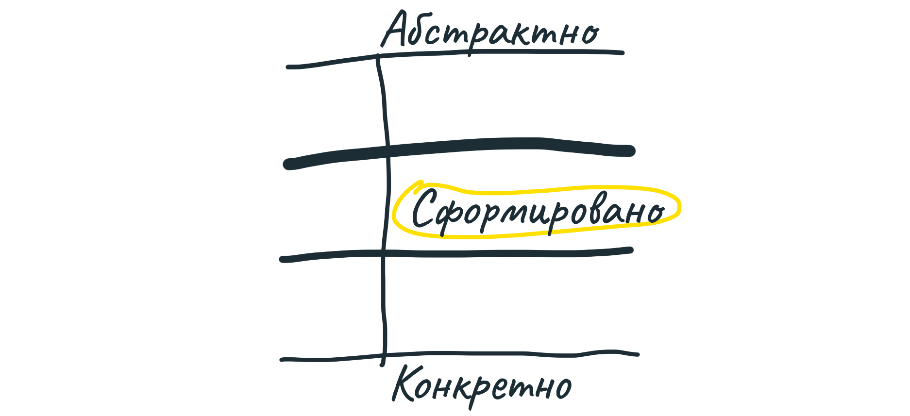
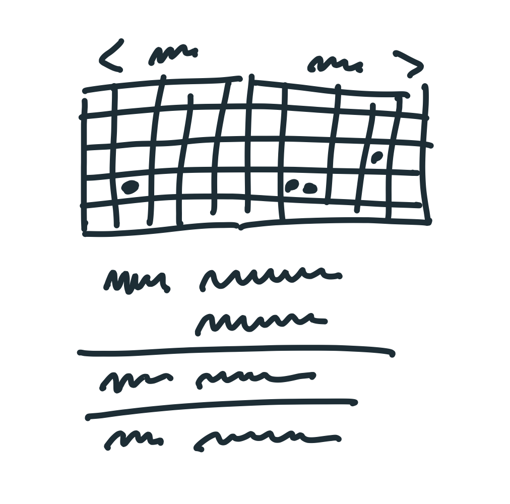

## Формирование проекта

Когда мы формируем проект, мы ищем золотую середину — не слишком абстрактно, не слишком конкретно. 

### Схемы экранов — слишком конкретно

Начиная работу сразу со *схем экранов* (wireframes), вы слишком рано принимаете слишком много решений. Дизайнеру не остаётся пространства для манёвров. Один знакомый сформулировал так:

> Я даю схему экрана дизайнеру и говорю ей: «Я, конечно, нарисовал вот так, но это не то, что я хочу от тебя получить. Придумай, как это сделать по-другому!» А это непросто, если за тебя уже всё нарисовали.

Слишком конкретные требования к дизайну также ведут к неверным оценкам объёма работы. Звучит странно, но чем конкретнее задание, тем сложнее его оценить — подгоняя решения к требованиям, команда сталкивается со сложностями, которые были не видны в начале. Когда задание звучит как «сделай вот так», пропадает возможность пересмотреть решения, не стоящие усилий.

### Слова — слишком абстрактно

Другая крайность — проекты, которые сформулированы парой строк текста. Никто не сможет осознать, в чем именно состоит проект. «Создать календарь» или «добавить уведомления в группы» — вроде понятно, но что конкретно? Команда не понимает, что точно должно входить в проект, а чего, наоборот, делать не надо. Другой знакомый сказал об этом так:

> Приходится читать мысли, делать что-то, потому что «мы поймём, чего хотим, когда увидим это».

Оценки таких проектов также выходят из-под контроля. Нет границ, позволяющих понять, где нужно остановиться.

### Пример из жизни: календарь с точками

Вот пример удачно сформированного проекта.

Мы запустили Basecamp 3 без календаря. Продукт показывал события простым списком, без какой-либо сетки по дням, неделям или месяцам.

Клиенты сразу же стали просить добавить календарь. Мы разрабатывали календари раньше и знали, насколько это сложно. Можно спокойно потратить 6 месяцев на *нормальный* календарь, в котором были бы:

* перетаскивание событий по сетке;
* перенос длинных событий на новую строку;
* разные отображения для месяцев, недель, дней;
* изменение длительности события путём перетаскивания его за угол;
* разные цвета для разных категорий событий;
* разные поведения для компьютеров и мобильных устройств.

В прошлой версии Basecamp был календарь, но только 10% пользователей им пользовалось. Вот почему у нас не было *аппетита* потратить 6 месяцев на его разработку. С другой стороны, мы были бы готовы потратить 6-недельный цикл одной команды, если бы нашли другое решение проблемы. Это примерно одна десятая часть работы, которую представляют люди, когда говорят «календарь». Весь вопрос в том, какая именно десятая.

Мы провели исследование (о нём в следующей главе) и более чётко сформулировали проблему, которую хотели и могли решить. Нас вдохновил интерфейс календарей на телефонах с сеткой на 2 месяца, без интерактива. Каждое событие отмечается точкой под числом. Название события — в списке под сеткой, и нажатие на точку перематывает список до соответствующего события. Мы назвали проект «Календарь с точками».

Это не был полноценный календарь. Никакого перетаскивания событий. Вместо переноса длинных событий просто повторяем точки. Никаких категорий и разных цветов. Мы легко пошли на все эти жертвы, поскольку чётко представляли себе, какую проблему решаем.

Вот картинка, которая формулирует проект:

Обратите внимание, насколько груб набросок, сколько деталей упущено. У дизайнера была свобода в принятии конкретных решений по интерфейсу.

Но в то же время основная идея описана очень чётко. Ясно, как всё должно работать, что делать, и чего не делать.

Конечный результат работы команды выглядел так:

Важные свойства сформированного проекта:

#### 1. Незаконченность

По виду сформированного проекта ясно, что это черновик. Всем видны белые пятна, которые они заполнят своей работой. Слишком подробно сформированный проект отвлекает всех на ненужные в данный момент детали.

#### 2. Продуманность

Несмотря на очевидную незаконченность, сформированный проект тщательно продуман. Работа не разбита на части, но общее решение описано чётко и полно. Всем ясно, куда двигаться, даже если в процессе работы возникнут сюрпризы. Все возникшие вопросы решены.

#### 3. Границы

Сформированный проект также описывает, чего *не надо* делать, где нужно остановиться. У команды есть чёткое ограничение — время, которое она может потратить. Чтобы уложиться в это время, нужно знать, что оставить за бортом.

Итак, границы проекта дают команде свободу принятия решений, а продуманность решения и ограниченность служат регуляторами, которые не позволят команде сделать ненужное или зайти в тупик.

### Кто формирует проект

Формирование проекта — креативная работа, но в то же время она требует учёта технических ограничений и приоритетов бизнеса. Вам нужно либо погрузиться во все эти области, либо работать в команде с ещё одним-двумя людьми.

На практике формирование проекта — в основном дизайн. Результат этой работы — понимание того, как с продуктом (или его частью) взаимодействует пользователь.

Чтобы формировать проект, не нужно быть разработчиком, но нужно понимать разработку — знать, что возможно, что трудно, а что легко. Это необходимо, чтобы заранее видеть возможности и препятствия в реализации проекта.

Это также аналитическая работа, требующая критического подхода. В чём именно проблема, которую решает проект? Почему она важна? Что именно считать успехом? Кого коснётся проект? Чем придётся пожертвовать, если взять проект в работу?

Как часто бывает в начале творческого процесса, формирование проекта — закрытый процесс. Вы набрасываете идеи в одиночку или с одним-двумя коллегами, на бумаге или доске. Пока ещё никто другой не сможет понять, что вы имеете в виду, просто посмотрев на эти наброски. Вы движетесь быстро, без сожаления отметая одну идею за другой.

### Два потока

Нельзя чётко запланировать формирование проекта, поскольку по своей природе эта работа полна неопределённостей. Поэтому у нас есть два отдельных потока — один для формирования, другой для разработки. В течение каждого цикла команды разработки работают над ранее сформированными проектами, а команды менеджеров формируют проекты для будущих циклов. Эта работа не обсуждается с другими командами, пока не будет принято решение передать сформированный проект в работу. Поэтому, если проект не складывается, у менеджера есть варианты — положить проект на полку или отменить.

### Этапы формирования проекта

Вот 4 основных этапа, которые мы разберём в следующих главах.

1. **Обозначьте границы**. Мы формулируем проблему и оцениваем, насколько важно её решить.

2. **Набросайте элементы решения**. Мы используем более абстрактные методы, чем схемы экранов, и это даёт нам возможность быстрее рассмотреть множество идей. Результат — краткое, без подробностей, описание проекта, который решает проблему и может быть реализован в заданные сроки.

3. **Оцените риски**. Когда у нас есть решение, мы смотрим, что может пойти не так — ищем скрытые трудности или зависимости, которые застопорят работу. Далее либо урезаем решение, либо предлагаем способы уменьшить риски.

4. **Напишите презентацию**. Когда проект кажется готовым к передаче в работу, мы пишем формальный документ — презентацию. Она включает в себя описание проблемы, ограничений, предложенное решение, риски, ответы на найденные заранее вопросы. Презентации уходят на голосование — и если проект одобрят, презентация станет основой для работы команды разработки.