## Найдите элементы решения

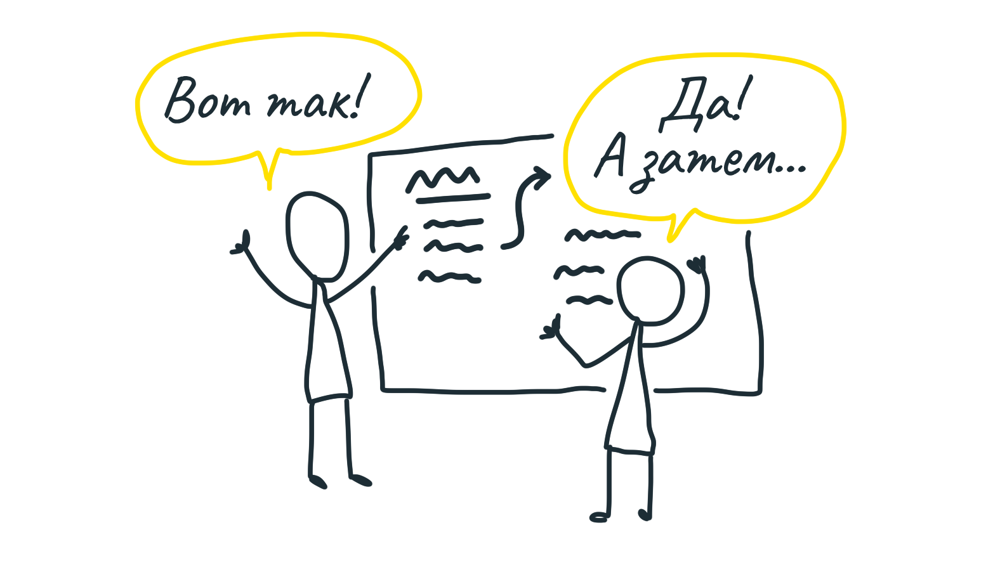

Когда мы ограничили наш аппетит и определили проблему, которую решаем, время перейти от слов к делу (то есть от сырой идеи к интерфейсному решению). Искать решение проблемы можно десятками разных способов. Нам важно двигаться быстро и пробовать совсем разные идеи, не погружаясь сразу глубоко.

### Выберите правильную скорость

В этом нам помогают две вещи.

Во-первых, собираем только действительно нужных людей — или никого. Менеджер, формирующий проект, либо работает один, либо с тем, кто может полноценно участвовать в поиске решения. У этого человека уже есть нужные знания, его не требуется вводить в курс дела, он честен и может быстро отбраковывать идеи.

Во-вторых, избегаем подробностей в набросках. Если сразу рисовать полноценные схемы экрана, мы не заметим, как погрязли в деталях и упустили время обработать широкий спектр разных идей.

Фокус в том, чтобы проработать каждую идею **минимально** глубоко. Ищем ответы на вопросы:

* куда в текущий продукт будет добавлена наша новая идея?
* какой путь будет к ней вести?
* каковы её основные части или сценарии?
* куда она в конце приводит?

Для этой работы у нас есть два отличных приёма: **макетные платы** и **толстые маркеры**. С их помощью мы делаем наброски сценариев, обсуждаем плюсы и минусы, будучи уверенными, что говорим об одном и том же.

### Макетные платы

Идея была подсмотрена в схемотехнике и означает прототип устройства, в котором все компоненты соединены друг с другом, но не в готовом оформлении, а на временной плате.

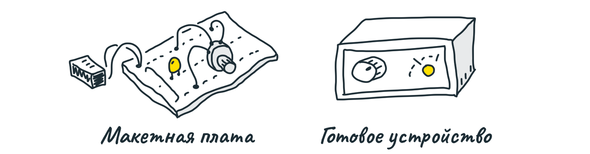

Разговор на уровне «а не подключить ли нам индикатор и регулятор?» сильно отличается от обсуждения материала коробки, расположения регулятора слева или справа от лампочки, скругления углов устройства и тому подобного.

Мы набрасываем ключевые компоненты и связи в интерфейсе, который придумываем, не затрагивая его внешний вид. Рисуем только:

1. **Места**. Это части интерфейса, в которые можно попасть — экраны, диалоговые окна, меню.
2. **Действия**. Это части интерфейса, с которыми можно взаимодействовать — кнопки, поля форм, и т.д. Мы считаем экранный текст «действием», поскольку читая его, пользователь получает информацию для будущих действий.
3. **Связи**. Это линии, которые показывают, как действия переносят пользователя с одного места в другое.

В набросках не используем картинки, только слова! Значение имеют только компоненты (места, действия) и их связи. Набросав их, мы быстро поймём, решает ли этот набор действий нашу проблему.

### Пример

Предположим, у нас продукт для создания счёт-фактур (инвойсов). Мы хотим добавить Автоплатёж, чтобы клиенты наших клиентов могли оплачивать будущие инвойсы автоматически.

Как включить автоплатёж? Что для этого требуется? Начнём с того, где пользователь встречается с автоплатежом. Пусть это будет страница инвойса. Пишем и подчёркиваем.

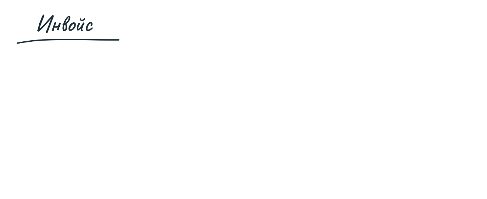

Дальше, пусть на этой странице появится новая кнопка «включить автоплатёж». Это действие. Пишем его под названием места.

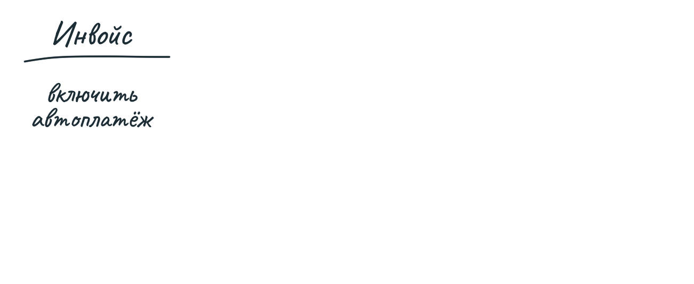

Куда ведёт эта кнопка? В какое-то место для настройки автоплатежа. Мы не решаем, будет ли это новая страница, модальное окно или ещё что-нибудь. С точки зрения нашей «топологии» это неважно. Рисуем связь действия с новым местом.

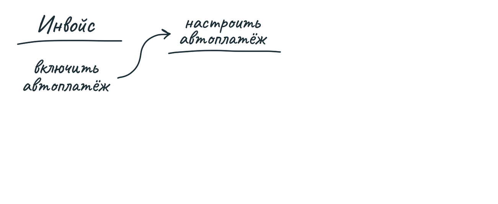

Дальше. Что есть в настройке автоплатежа? Поля для ввода данных кредитки? Или у пользователя уже сохранены эти данные? Нужна ли поддержка ACH или других методов оплаты?

Уже для того, чтобы понять, что тут писать, требуется достаточно подробно обсудить возможности и требования.

Пусть по мере этого обсуждения мы решаем спрашивать данные кредитки и показываем логотип финансового учреждения.

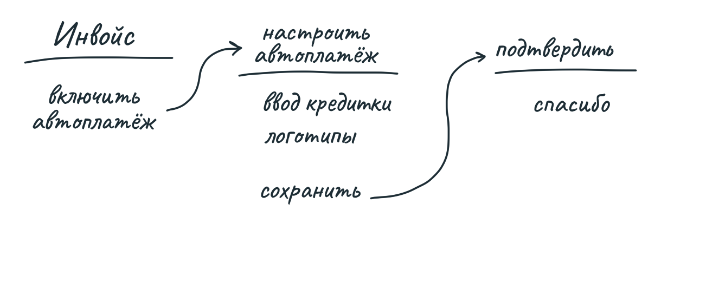

Вроде бы всё просто. Но стоп! Отправка этой формы означает оплату изначального инвойса или нет? Хмм. Теперь у нас есть вопросы как к функционалу, так и к интерфейсу. Автоплатёж применяется только к будущим инвойсам или к текущему тоже? В какой момент нам нужно объяснить это пользователю? Вопросы становятся глубже, а ведь мы написали всего несколько слов.

Лёгкость нашего наброска позволяет нам мгновенно оценивать разные варианты.
Мы можем добавить опцию в настройки автоплатежа:

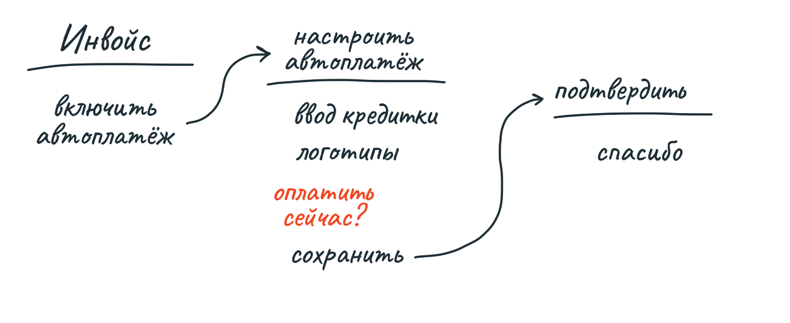

Но тогда экран подтверждения становится излишне сложным. Нужно показывать квитанцию и другую важную информацию об оплате.

Как насчёт другой идеи? Вообще не начинать со страницы инвойса. Вместо этого, добавим опцию «Использовать автоплатёж в будущем» в Оплату инвойса. Тогда будет ясно, относится ли автоплатёж к текущему инвойсу. Можно добавить сообщение «Автоплатёж был подключён» в Подтверждение оплаты.

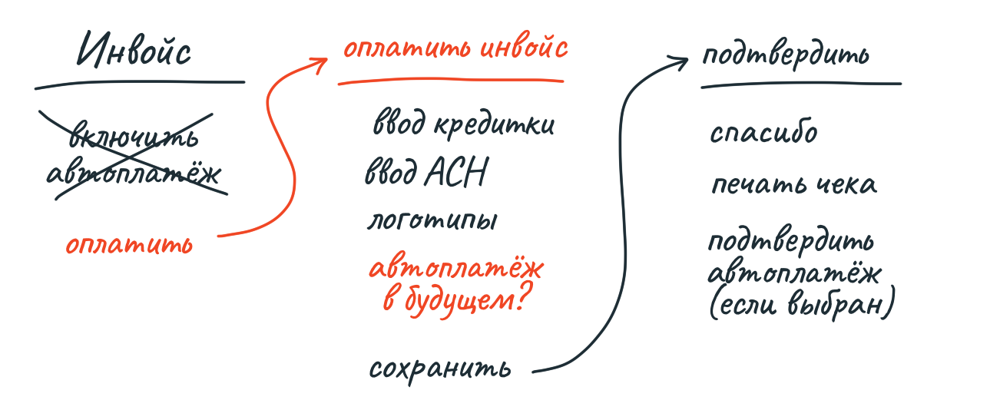

Пока рисовали, вспомнили, что текущая форма оплаты поддерживает не только кредитки, но и ACH. Быстренько обсуждаем, решаем тоже поддерживать ACH.

Что дальше? Как отключить подключённый автоплатёж? Сейчас у клиентов нет логинов и паролей, инвойсы оплачиваются через одноразовые ссылки. Сразу хочется добавить в проект разработку логинов и паролей. Однако команда решает, что это слишком большой объём работы. Будет достаточно, если человек, оплативший инвойс, обращается к отправителю и просит отключить автоплатёж.

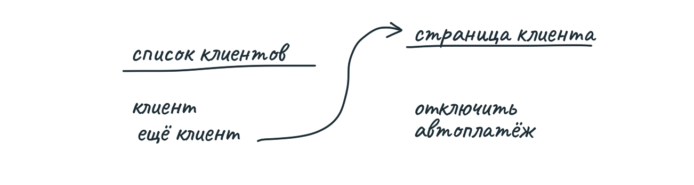

Этот пример показывает, с какой скоростью и какой глубины идёт обсуждение макетной платы. Описывая «места», «действия» и «связи», мы можем быстро проработать принципиальные дизайнерские решения, не отвлекаясь на мелочи.

В конце этого процесса — когда схема кажется нам окончательной — в нашем распоряжении есть все элементы для того, чтобы сформировать проект.

### Наброски толстым маркером

Иногда для обсуждения идеи принципиален внешний вид. Тогда набросок в стиле макетной платы не имеет смысла. Например, нужно определить именно расположение элементов (которое мы игнорируем, рисуя схему). Однако мы по-прежнему не хотим тратить время на прорисовку полноценных экранов, неизбежно включающих в себя кучу мелочей. Вместо этого мы рисуем наброски толстым маркером.

Смысл этого приёма — использовать настолько большой размер маркера, чтобы добавить мелкие детали было практически невозможно. Мы рисуем и на бумаге настоящими маркерами, и на планшетах кистью большого размера.

Вот пример. Мы заметили, что часто создаём в списках ненастоящие задачи в качестве разделителей, например, «-----». Появилась идея добавить поддержку настоящих разделителей, и нужно было изучить последствия этого решения. Допустим, в списке появляется разделитель, и тогда сверху будут независимые задачи, а под каждым разделителем — сгруппированные.

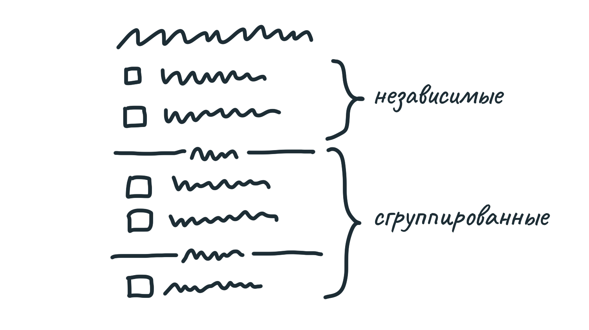

В каждую группу (включая группу «свободных» пунктов) можно добавить пункт.

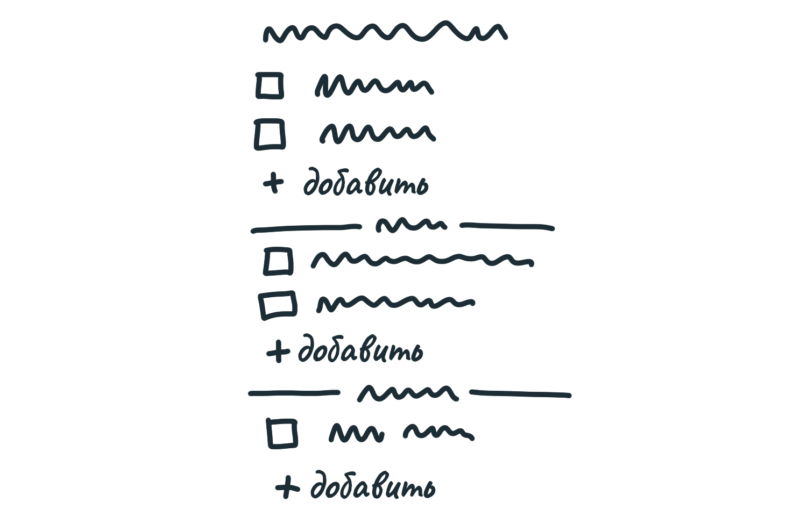

Не очень хорошо, что кнопки разбивают визуальное единство списка. Возможное решение — поместить кнопку «Добавить» внутрь меню, которое уже и так есть у каждого пункта.

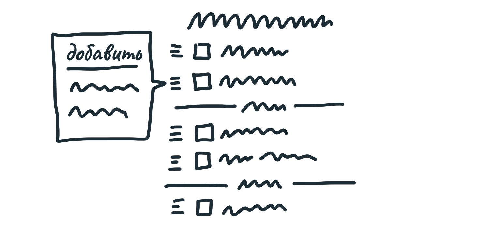

Рисуя наброски, мы меньше ограничены, чем рисуя схемы. Поэтому надо следить за собой и не увлечься мелочами, чтобы случайно не получился полноценный экран, нарисованный жутко жирными линиями. 

Может показаться странным, что мы выделяем наброски толстыми маркерами в отдельный инструмент при создании проекта. Но они позволяют нам осмотреться вокруг, прежде чем погружаться в детали, и убедиться, что мы не пропустили ничего принципиального.

### Результат работы — элементы

В примере с Автоплатежом мы получили чёткий набор элементов:

* новая галочка «оплачивать автоматически в будущем?» на экране «Оплатить инвойс»
* опция «отменить автоплатёж»

В примере с группировкой пунктов в списках задач мы получили следующие элементы:

* независимые пункты выше первого разделителя
* сгруппированные пункты ниже разделителя
* кнопка «добавить» либо под каждой группой, либо в контекстном меню.

Похожим образом мы набросали толстым маркером решение для календаря с точками:

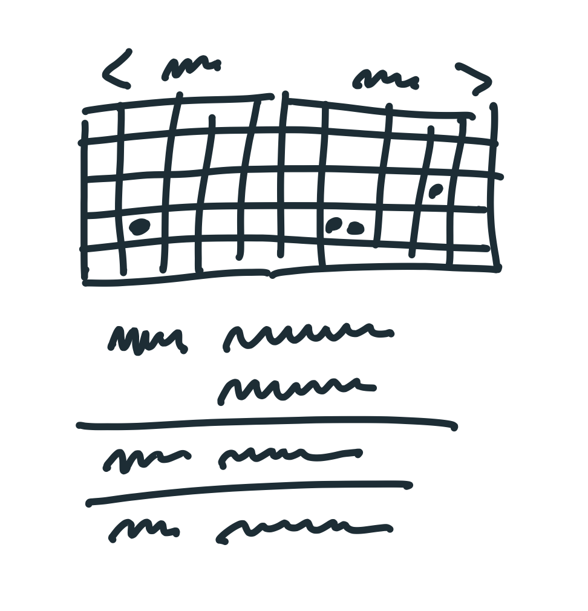

Набросок позволил нам определить элементы:

* сетка на 2 месяца;
* точки обозначают события;
* под сеткой — простой список событий, который скроллится по мере нажатия на точки.

Ровно тот объём конкретики, который нужен нам для формирования проекта.

### Свобода для дизайнера

Когда придёт время передавать проект дизайнеру, не придётся говорить: «Я нарисовал, но ты так не делай». Любые решения в ваших набросках влияют на решения того, кто с ними работает, даже если вы этого не планировали. Кроме того, набросок, который не говорит лишнего, позволяет всем двигаться быстро и оставляет пространство для работы дизайнера.

Сформированный проект — это не «требования» и не «спецификации». Скорее, вы задаёте правила игры, а команда разработки по ним играет.

### Ещё не готово к передаче

Мы начали с расплывчатой идеи — например, «сгруппировать пункты в списке» — а сейчас у нас уже есть набор элементов решения. Но проект ещё не готов к передаче. Мы определили подход, он кажется правильным — теперь нужно проверить риски. Не осталось ли скрытых принципиальных вопросов? Не возникнет ли препятствий, которые помешают разработать проект в срок? 

В следующей главе мы займёмся управлением рисками. А затем упакуем сформированный проект в презентацию.

### Ещё не обязательство

Также не забывайте, что на этом этапе от проекта вполне можно отказаться, по любым причинам. Пока не выделены никакие ресурсы, не взята ответственность. Мы просто изучили сырую идею и приблизили её к состоянию проекта, готового к передаче.