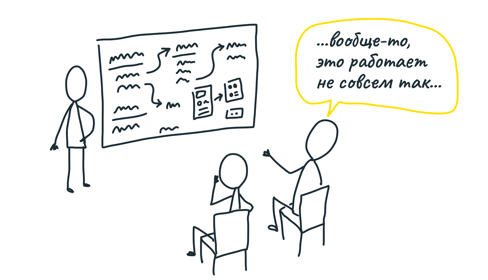
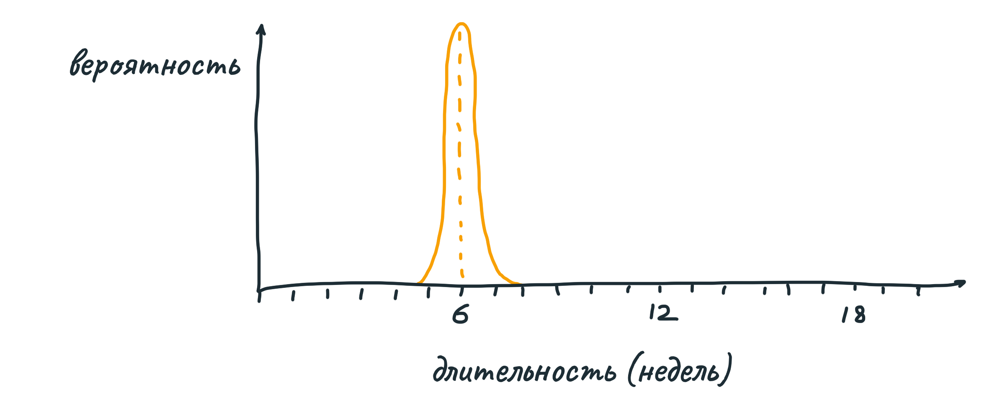
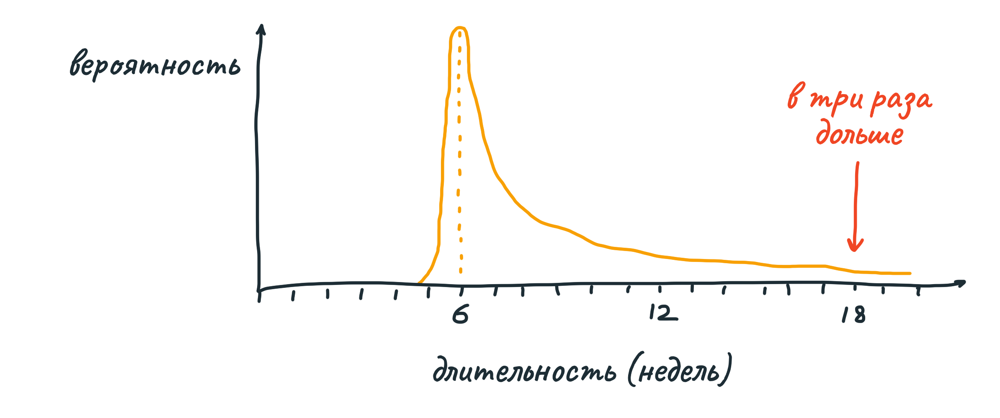
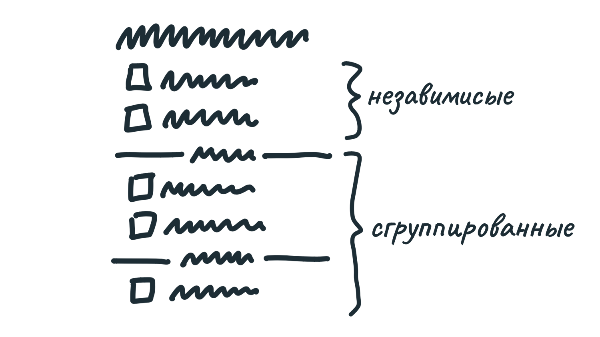
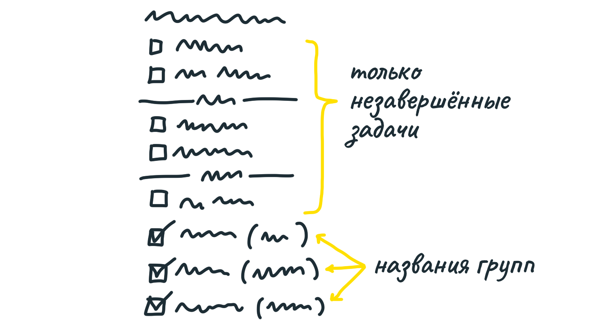

## Риски и белые пятна

Мы формируем проект, рассчитанный на конкретный срок (в нашем случае, 6 недель). В прошлой главе, пользуясь опытом и интуицией, мы определили элементы, которые, как нам кажется, укладываются в этот срок. Однако достаточно будет одного «белого пятна», чтобы выйти из бюджета и провалить проект. Представьте, команда находит непредвиденную проблему, на решение которой уходит 2 недели — треть бюджета потрачена впустую! 

А иногда такие проблемы вообще не имеют очевидного решения. Однажды мы взяли в работу проект по редизайну списка проектов на главной странице Basecamp. Мы решили, что дизайнер вполне разберётся, и не сформировали проект как следует. Но в процессе оказалось, что задача намного сложнее, чем мы думали вначале. Спустя 6 недель никто так и не смог придумать подходящее решение, и проект был отменён.

Конечно, неопределённости будут всегда. Но это не значит, что не надо искать их как можно раньше. Цель — отдать в работу как можно менее дырявый проект.

### Виды риска

С точки зрения рисков, хорошо сформированный проект выглядит как 
распределение вероятностей с лёгким хвостом. Ключевые элементы понятны, белых пятен нет — проект будет завершён в срок плюс-минус неделя.

Однако любые белые пятна — технические вопросы, неверно истолкованные зависимости, и так далее — увеличивают вероятность задержки сдачи на порядок.

Чтобы минимизировать риск, мы описываем проект как набор независимых, понятных частей, которые соединяются понятными способами.

### Ищите белые пятна

В прошлой главе мы делали наброски элементов, и это была быстрая исследовательская работа. Она шла вширь, не вглубь. 

Сейчас — время замедлиться и критично оценить выбранное решение. Мы ничего не упустили? Что может пойти не так?

Пройдите по сценариям решения в режиме «замедленной съёмки». Как конкретно пользователь попадает из начала сценария в конец? Подробный проход может выявить вопросы, требующие ответа.

Трезво оцените жизнеспособность решения. Ищите ответы на вопросы:

* потребуется ли делать вид работ, который мы никогда раньше не делали?
* мы точно знаем, как соединяются части проекта, или только предполагаем?
* нужно ли сейчас пойти на какие-либо компромиссы, чтобы команда могла спокойно работать?

### Пример

Когда мы формировали проект «Группы в списках дел», мы добавили идею разделителей:

Сама идея выглядела хорошо, и логика «сгруппированных» и «свободных» дел как будто имела смысл. Но копнув глубже, мы обнаружили, что не знаем, как отображать завершённые дела. В конце каждой группы? Или в конце общего списка, повторив все разделители? Или вообще заново придумать, как мы работаем с завершёнными делами?

Это было белое пятно. Если отдать проект в работу в таком виде, на плечи команды ляжет несправедливая обязанность доделать формирование проекта, а сроки при этом никто не отменял. 

Из прошлого опыта мы знали, что любое изменение поведения завершённых дел влияет на сценарии использования, навигацию, эффективность, практически на всё. Чтобы исключить из проекта белое пятно, мы приняли решение оставить завершённые дела без изменений. Не группируем, не отделяем. Вместо этого, к каждому завершённому делу добавляем в скобках название группы. Это визуальный шум, но он оправдан — реализация стала кардинально проще. 

Компромиссы такого рода трудно принимать, когда на тебя давит дедлайн. Можно было придумать множество других вариантов или вообще более глубоко переработать архитектуру списков дел. Дизайнер мог бы подумать — «возможно, если я поработаю над стилями, то завершённые дела внутри каждой группы окажутся лучшим решением». И потратить несколько дней (а иногда недель) часто на то, чтобы зайти в тупик.

Формируя проект, мы думаем не про внешний вид, а про свойства и риски. Приняв компромисс, мы не теряем никаких элементов найденного решения, и сильно уменьшаем риск.

Готовя презентацию, мы укажем на эту «заплатку», так что все, кого касается проект, поймут, что к чему.

### Обозначьте границы

Каждый в команде хочет сделать свою работу наилучшим образом. Поэтому все будут прорабатывать каждый вопрос максимально глубоко. Чтобы оставаться в рамках аппетита, пропишите, чего делать не нужно, какие сценарии не нужно обрабатывать.

Например, как-то мы работали над идеей уведомлений для групп пользователей. Вместо того, чтобы выбирать по одному пять разработчиков из длинного списка людей, хотелось просто нажать «разработчики». По мере обсуждения мы начали находить в продукте множество других мест, где такая логика была бы уместна. Почему бы не объединять людей в группы, когда добавляешь комментарий? Или когда создаёшь задачу? Или когда пишешь в чат?

Однако мы решили, что в рамках достижения конкретной цели необходимо ограничиться уведомлениями. Поэтому мы специально отметили, что остальные сценарии выходят за рамки проекта, и делать их не нужно.

### Урезайте

Возможно, в решении есть части, которые вызывают большой энтузиазм но не очень-то и нужны на самом деле. Когда мы формировали проект группировки в списках дел, мы очень хотели назначать группам разные цвета. Очевидно, выглядело бы очень круто, и даже немного более полезно. Но мы решили вырезать эту идею из презентации. Мы упомянули её как «было бы прикольно», но обозначили, что это не обязательная часть проекта.

### Поговорите с техническими экспертами

До этого момента, формирование проекта шло внутри вас (или вашей микро-группы из 2-3 человек). Прежде чем начинать работу над презентацией, определите, есть ли части проекта, реализацию которых вы не полностью понимаете. Возможно, вы исходите из предположений, которые лучше обсудить с экспертом или проверить на реальных данных.

Важно дать понять, что вы обсуждаете идею, а не принятый в работу проект. Ещё важнее не формулировать вопросы так: «Возможно ли это?» В мире разработке всё возможно, и ничто не бесплатно. Вам нужно узнать, реализуема ли идея в рамках вашего аппетита. «Возможно ли это за 6 недель?» — вот правильный вопрос.

Не просто спрашивайте эксперта «что ты думаешь об этом?». Ищите с его помощью белые пятна и риски провала. 

Разговор с экспертом — ещё не презентация. Вместо документа или слайдов, достаточно разговора и набросков на доске или бумаге. Воссоздайте наброски найденного вами решения, проведите эксперта по сценариям. Только затем обсудите замечания и изменения. Что может пойти не так? Что можно было сделать проще? А что стоит сделать иначе?

По результатам этого разговора (или нескольких) вы либо подтвердили свою правоту, либо возвращаетесь назад, пересматриваете идеи и формируете проект заново (целиком или частично).

### Всё готово к презентации

В конце этого процесса у вас есть:

* набор элементов решения проблемы;
* варианты действий в местах потенциальных белых пятен;
* границы, обозначающие, чего делать не нужно.

От размытой идеи с непонятными перспективами мы перешли к ясному проекту с проработанными рисками, который не страшно представить команде.

Время создать **презентацию**. Её цель — сделать так, чтобы люди, не погруженные в контекст вашего проекта, поняли, какую проблему вы решаете, почему это важно, каково ваше решение, из чего оно состоит, а что делать не нужно.
