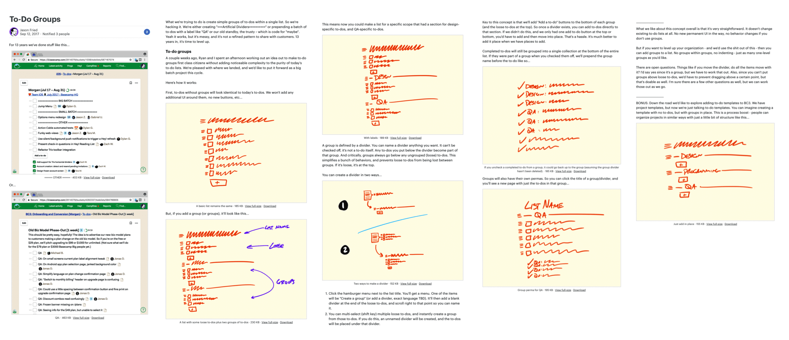
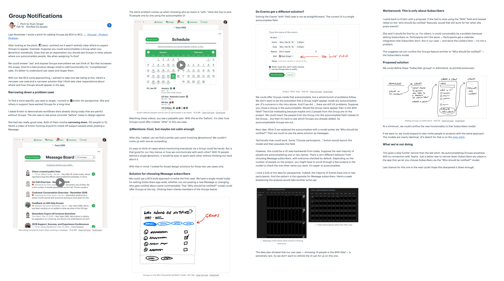

##  Презентация

Вы уверены в своей идее, она достаточно проработана для того, чтобы рассказать о ней широкому кругу людей. Но проект всё ещё в вашей голове, а также в непонятных набросках. Нужно придать проекту форму, с помощью которой другие люди смогут понять идею, оценить её, дать обратную связь и принять осознанное решение.

В этой главе мы изучим, из чего состоит презентация, и рассмотрим презентации реальных проектов Basecamp.

В наших презентациях всегда есть 5 ингредиентов:

* **Проблема** — сырая идея, сценарий или что-то, что мотивирует нас работать над проектом;
* **Аппетит** — сколько мы хотим потратить и как это ограничивает решение;
* **Решение** — набор элементов, представленных в виде, понятном широкому кругу людей;
* **Белые пятна** — части решения, которые стоит обсудить, чтобы избежать проблем в дальнейшей работе;
* **Границы** — всё, что не нужно делать в рамках проекта.

---

### Ингредиент 1 — проблема

Важно всегда презентовать проблему и решение вместе. Звучит очевидно, но удивительно часто презентации (включая наши собственные) начинались сразу с описания решения. Кажется, что проблема, которую проект призван решить, всем ясна.

Начинать с «давайте сделаем» опасно. Не поняв хорошо проблему, нельзя понять, насколько подходит предложенное решение. Обсуждение проблемы также помогает понять друг друга позднее, во время принятия решения по передаче проекта в работу. Что если решение отличное, но проблема актуальна только для узкого круга пользователей, которые не представляют реальной ценности для бизнеса? Уточнение проблемы перед обсуждением решения экономит время позже.

Насколько подробно описывать проблему — зависит от того, насколько ваши собеседники погружены в контекст. Обычно лучшее описание — это одна конкретная история, показывающая, почему сейчас не так, как надо. Команде будет легче примерить ваш проект на эту историю, чтобы оценить, насколько станет лучше.

### Ингредиент 2 — аппетит

Определение аппетита — продолжение определения проблемы. Мы хотим решить проблему не «вообще», а за две или шесть недель силой одной команды.

Упоминание аппетита в презентации предотвращает непродуктивные обсуждения лучших решений. Лучшие решения есть всегда, если не помнить об ограничениях. Легко предлагать сложные и дорогие решения. А вот проработать простое решение с учётом аппетита уже не так просто. 

### Ингредиент 3 — решение

Иногда на обсуждение попадают проблемы без решения. «Нужно сделать так, чтобы находить информацию в сообщениях было легче. Клиенты жалуются». Это ещё не проект, готовый к презентации. Отдать его в работу означает заставить команду вместо разработки заниматься исследованием. 

В таких случаях необходимо вернуться к формированию проекта до момента, когда ясны проблема, аппетит и решение.

#### Помогите им увидеть

Когда вы искали элементы решения, было важно найти нужный уровень абстракции — не делать слишком детальные наброски, чтобы не терять темп. 

На этапе презентации задача немного другая. Решение уже найдено — нужно замедлиться и основательно подготовиться. Излишние детали по-прежнему не нужны, однако стоит удостовериться, что информации достаточно, чтобы люди со стороны могли понять и в чём проблема, и в чём решение.

То есть конкретика нужна, но только чтобы достаточно ясно объяснить проблему и решение, а не нарисовать полноценные интерфейсы. Иначе есть риск увести обсуждение в цвета и шрифты.

К сожалению, наброски часто отражают ход ваших мыслей и ясны вам, но не ясны другим. Если собеседник не формировал проект вместе с вами, разобраться в набросках может быть невозможно. Значит, нужны приёмы для презентации идеи широкому кругу людей без ухода в лишние детали. Вот эти приёмы:

#### Наброски поверх скриншотов

Допустим, на этапе формирования вы набросали такую макетную плату:

Тем, кто в первый раз посмотрит на схему, трудно визуализировать эти элементы. Вы уже знаете, как выглядит экран, который вы хотите изменить, и представляете, какие изменения хотите сделать. Возьмите скриншот экрана и сделайте набросок толстым маркером поверх:

Хмм, всё ещё слишком много приходится додумывать. Добавить деталей в этом случае — правильное решение.

Взглянув на изображение, легче понять, о чём речь. Увы, нам пришлось принять некоторые дизайнерские решения по композиции нового блока, которые лучше бы оставить на ответственности дизайнера. Стоит добавить в презентацию комментарий, что тут у дизайнера свобода выбора.

В этом примере мы сознательно добавляем деталей, которые помогают другим людям быстрее понять проект и убедить их. Впрочем, часто для понимания достаточно более простых приёмов.

#### Наброски толстым маркером с подписями

Для презентации некоторых идей наброски толстым маркером работают так же хорошо, как и ранее при формировании проекта. Стоит только сделать их более читаемыми, добавив подписи, например, так:

Можно пронумеровать элементы наброска, чтобы обращаться к номерам в обсуждении:

### Ингредиент 4 — белые пятна

Для описания белого пятна часто достаточно нескольких строк текста. Например, в проекте добавления платёжной формы автор проекта обозначил как белое пятно вопрос создания URL-ов, которые в первой версии не могли быть произвольными. Подобного рода вещи не критичны для проекта в целом, но упоминать их полезно, чтобы обозначить неопределённости.

### Ингредиент 5 — границы

Имеет смысл отдельно указать, что не входит в рамки проекта. В примере выше команда заранее решила, что поле ввода текста не должно поддерживать никакое форматирование (WYSIWYG). Достаточно дать возможность загрузить логотип и ввести текст заголовка, для этого сделали отдельную страницу редактирования. Текст с форматированием — это то самое «лучшее» решение, которое было важно урезать с учётом аппетита проекта.

### Примеры

Вот пара реальных презентаций.

Первый пример — группировка в списке задач. Презентация начинается с того, как пользователи в текущей версии продукта создают «костыльные» пункты-разделители. Затем идёт описание основных идей с набросками-иллюстрациями.

[Увеличить изображение](https://basecamp.com/assets/books/shapeup/1.5/to-do_groups_pitch-ac9465339dfffb0b9cf634064b51b4d9336fe6d5c7410f7ed80abd1c1fbe5305.png)

Пара скриншотов демонстрирует проблему. Наброски толстым маркером демонстрируют решение и потенциальные белые пятна. 

Второй пример — проект по изменению уведомлений.

[Увеличить изображение](https://basecamp.com/assets/books/shapeup/1.5/group_notifications_pitch-ba3f748fe757356b59d0c63560bddf4744efb49b0e4dbd874a2f6cdb2faa1c7f.png)

Два видеоролика демонстрируют проблему. Наброски толстым маркером и макетная плата — решение. Чёрные картинки ближе к концу — графики с данными, подтверждающими решение.

### Публикация и обсуждение

Мы предпочитаем асинхронную (письменную) коммуникацию и собираем встречу только если необходимо. 

Таким образом, первый шаг — публикация презентации для всех участников голосования. У каждого будет возможность ознакомиться с документом заранее, в своём темпе, поэтому последующее обсуждение и голосование проходит быстро и продуктивно. Даже если кто-то из участников не успел просмотреть презентацию, вы сможете быстро провести их по готовому документу во время встречи.

#### Как мы используем для этого Basecamp

Мы публикуем презентации в виде Сообщений в Basecamp, в категорию «Презентации». Доступ к ним есть у команды продуктовой стратегии. Члены команды участвуют в обсуждении и голосовании.

Список презентаций в команде продуктовой стратегии в Basecamp:

Сообщение с презентацией:

Обратите внимание на размер аппетита — всего 1 неделя. 

Иллюстрации (например, наброски толстым маркером) мы обычно рисуем на iPad и вставляем внутрь сообщения как скриншот с подписью:

Участники оставляют комментарии асинхронно, по мере прочтения. Комментарии — не для принятия решений (для этого позже будет голосование), а для замечаний и ответов на вопросы.

В следующей главе мы рассмотрим, как презентации превращаются в запланированные проекты.