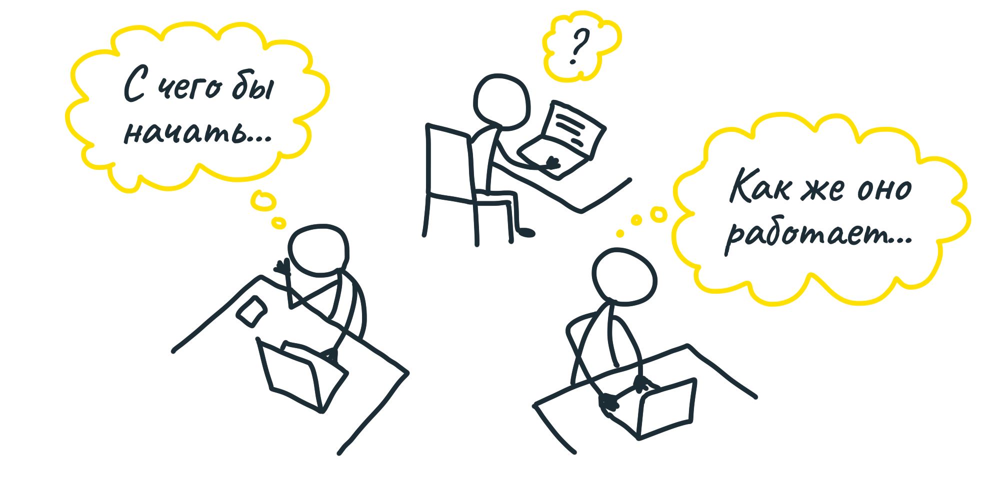
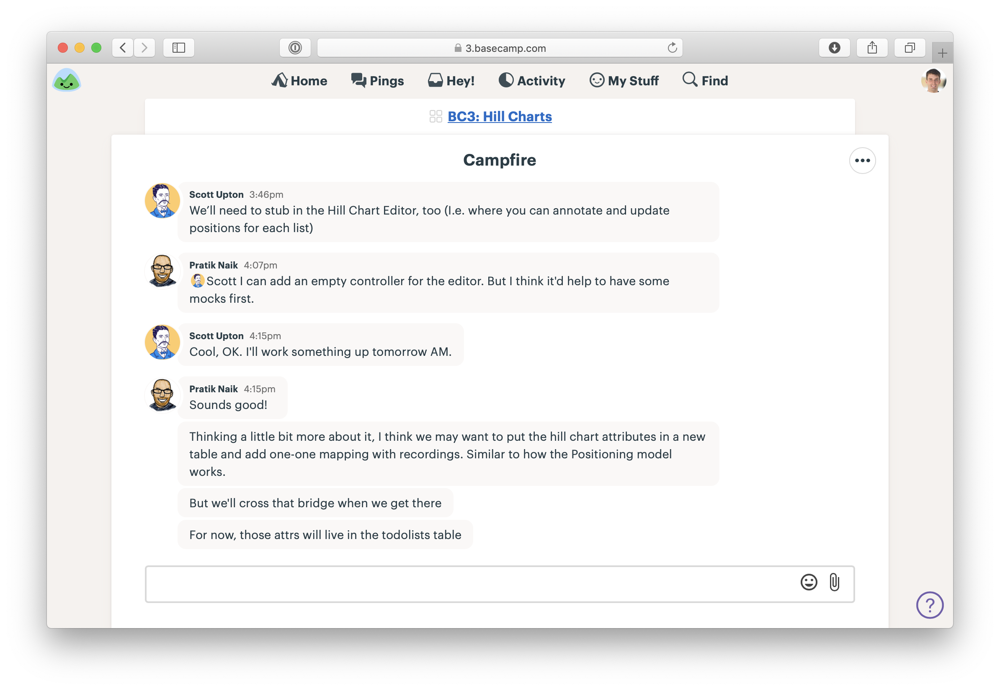

##  Передайте полномочия

Мы определились с проектами, пришло время нового цикла. С чего начать команде разработки?

### Проекты, а не задачи

Никто никому не назначает задачи. Нет менеджера задач или архитектора, который декомпозирует проект и раздаёт кусочки разным людям.

Разделять проект на задачи заранее — всё равно что запихнуть презентацию в шредер. У каждого будет только свой кусок. Наша цель — всегда иметь перед глазами проект целиком, чтобы у всех была общая картина.

Вместо этого мы выдаём команде проект и ограничиваем их работу лишь тем, что описано в презентации. Команда сама распределяет работу и выбирает подход. У команды есть полная независимость в реализации проекта так, как им удобнее. Этот метод отлично работает с талантливыми людьми, намного лучше, чем выдача тикетов в таск-трекере.

Обычно нельзя в начале цикла полностью описать, что именно нужно сделать для достижения результата. Любые заранее описанные планы придётся менять на ходу. И лучше всего поручить это самим дизайнерам и разработчикам.

Получая отдельную задачу, человек обычно не чувствует ответственности за то, как результат этой задачи соединяется с остальными частями. Планируя заранее, вы отгораживаете себя от реальности по ходу работы.

Мы не даём команде полную свободу. Мы сформировали проект, обозначили границы и ожидаем, что команда самостоятельно заполнит все детали, примет все дальнейшие решения, превратив проект в работающий продукт.

Вот почему так важно найти нужный уровень абстракции во время формирования проекта, без лишних деталей. Обладая талантом и опытом, команда разработки добьётся результата быстрее и лучше, чем если бы мы прописывали им максимально чёткое ТЗ.

### Критерий готовности — выпуск

В конце цикла команда должна опубликовать на сервер результаты работы (deploy). Если в работе было несколько мелких проектов, команда может публиковать их по своему усмотрению до конца цикла. 

Это требование позволяет работать правилу Предохранителя. Проект должен быть реализован за отведённое время, иначе наше голосование ничего не стоит.

Всё тестирование и проверка качества (QA) происходят внутри цикла. Команды добиваются этого, реализуя основные части проекта как можно раньше и передавая их на проверку по мере готовности (подробнее об этом позже).

Обычно мы не требуем работать в течение цикла над такими вещами, как документирование, маркетинг, описания для пользователей. У этих работ нет большого риска (они никогда не отнимают в 5 раз больше времени, чем ожидалось), их часто делают другие команды во время двухнедельного перерыва между циклами.

### Старт проекта

Формально проект начинается с создания проекта в Basecamp и добавления в него команды. Затем мы добавляем сформированную презентацию в Сообщения. 

Команды работают удалённо, поэтому мы используем чат в Basecamp, чтобы огранизовать звонок.

На встрече команда задаёт уточняющие вопросы. 

### Утаптываем поляну

Первая пара дней работы над проектом не выглядит как настоящая работа. Никто не отмечает задачи выполненными. Никто не публикует результаты. Показывать никому нечего. Даже обсуждений почти нет.

Почему? Каждый член команды изучает ситуацию и обдумывает дальнейшие шаги.

Менеджерам важно уважать этот странный период. Нельзя требовать от команд сразу начать выдавать результат. На то, чтобы изучить существующее окружение, составить в голове план «путешествия» к результату, требуется время. Просить видимых результатов в это время бессмысленно. Намного лучше дать команде понять, что у них есть право спокойно подумать, прежде чем начать. 

Обычно для периода молчания достаточно трёх дней, потом можно начать аккуратно вмешиваться.

### Придуманные и обнаруженные задачи

Поскольку команда получила проект целиком, задачи им нужно запланировать самим. Вначале команда ставит себе «придуманные» задачи — что, как им кажется в результате обдумывания, нужно начать делать. 

А вот по мере того, как команда погружается в работу, возникают вещи, которые не были видны заранее. Из них и состоит основная работа над проектом, и чаще всего в них скрывается всё самое сложное.

Команда «обнаруживает» задачи по мере работы. Например, дизайнер добавляет кнопку в интерфейс, но потом обнаруживает, что в мобильной версии для неё нет очевидного места. Создаётся задача — разобраться, что делать с этим действием в мобильной версии. 

Или первая итерация дизайна выглядит стройно и логично, но потом дизайнер обнаруживает, что нужно добавить пару абзацев объяснения, которое ломает всю сетку. Создаётся две задачи: переверстать экран с учётом нового текста, написать чистовой текст.

Часто задачи обнаруживаются в неожиданных местах. Допустим, разработчик занимается миграцией базы данных. Изучая взаимосвязи, она обнаруживает функцию, которую нужно обновить в другой части продукта. Она создаёт себе задачу обновить эту функцию позднее.

Итак, единственный способ узнать, что действительно нужно сделать — начать это делать. Это не значить начать делать что угодно. Стоит взять в работу основную часть, от которой зависят все остальные, причём такого размера, чтобы получить первый работающий результат за несколько дней.

В следующих главах мы узнаем, как команды выбирают, что брать, и как выстраивают совместную работу.