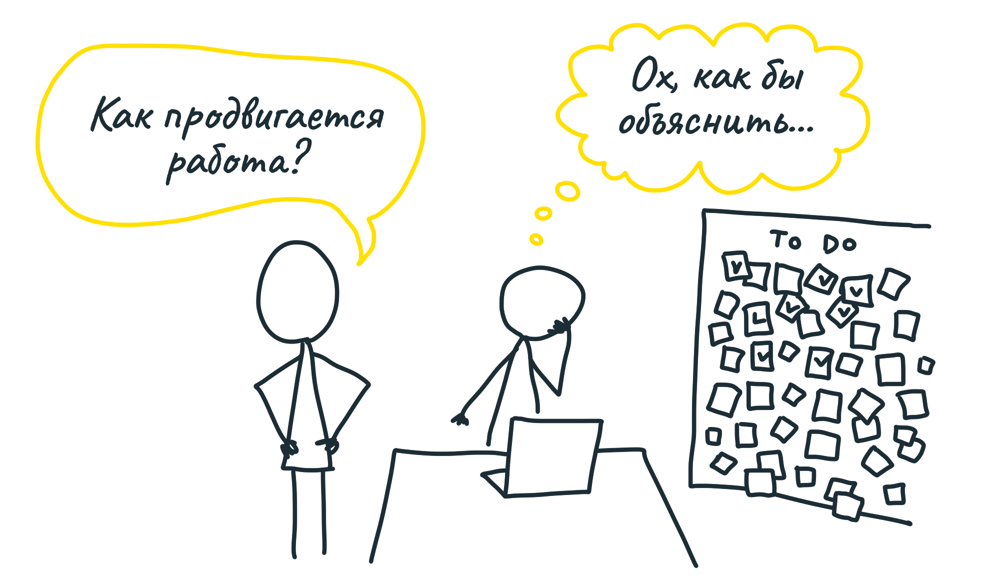
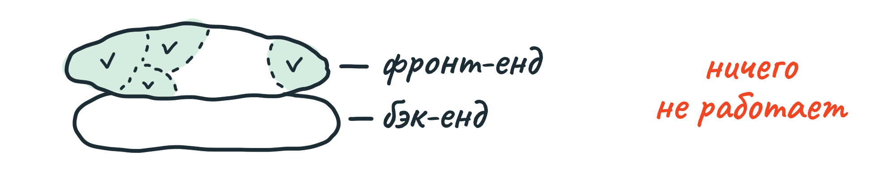
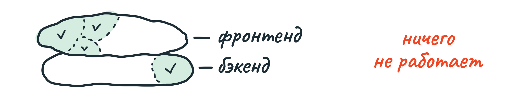
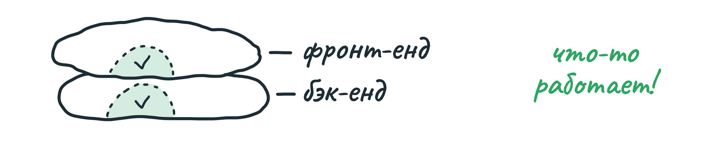
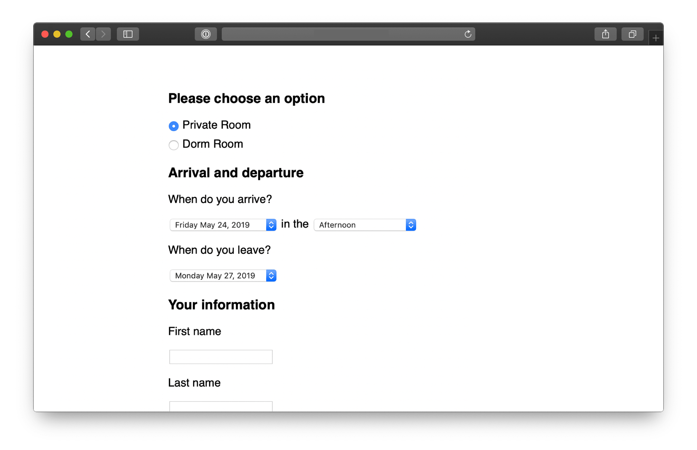
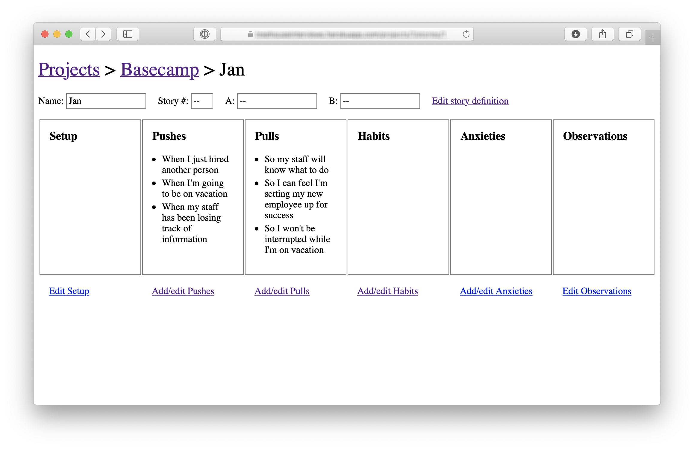
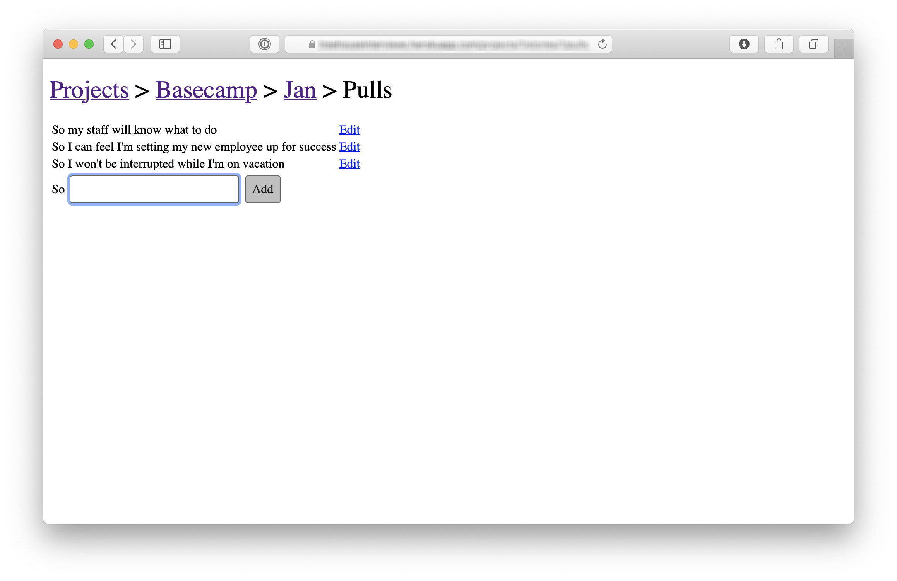
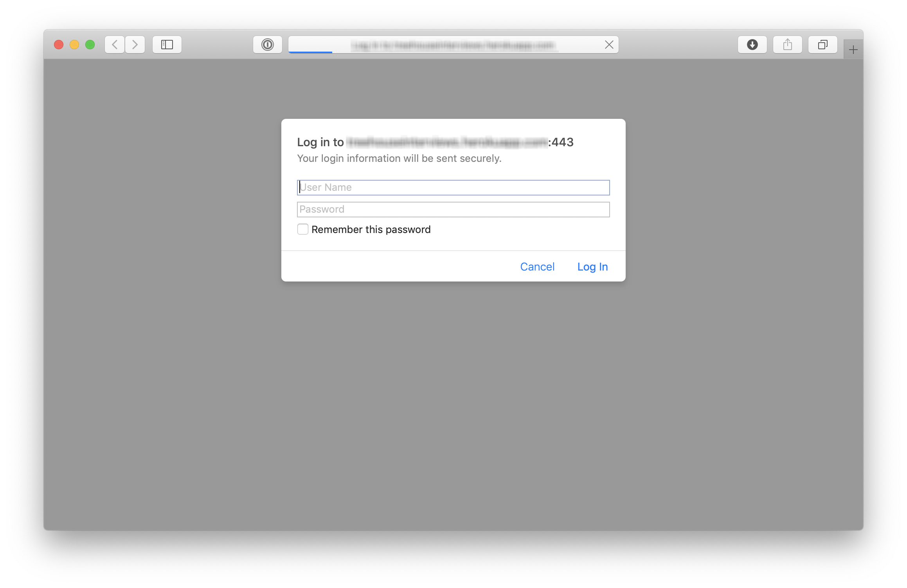

##  Один кусок готов

По мере того, как команда погружается в работу, она обнаруживает и учитывает задачи, которые нужно сделать, чтобы реализовать проект. Никто не создаёт окончательный план проекта, перечисляющий все его задачи. Если множество задач завершено, а потрогать руками нечего, нет ощущения движения вперёд. Несмотря на затраченные усилия, команда будет испытывать тревогу, поскольку не может показать результат. Много сделано, но ничего не готово.

Вместо этого мы просим команды стремиться сделать что-то готовое к показу как можно раньше — в течение примерно недели. Это значит глубоко проработать один кусок, а не начинать работу над несколькими кусками.

### Каждый кусок как проект

Многие проекты можно разбить на слои: фронт-енд и бэк-енд, или дизайн и код. Строго говоря, слоёв больше, но эти два труднее всего интегрировать.

Допустим, в начале проекта команда много работает над дизайном, рисует экраны или даже пишет для них шаблоны. Но пока нет связи с бэк-ендом, ничего не работает по-настоящему. 

Обратное также верно. Можно завершить много задач по бэк-енду, но пока нет интерфейса, работать с результатом нельзя. Как понять, что часть проекта, которую ты сделал, действительно решает свою задачу, если нельзя её потрогать?

Вместо этого возьмите один кусок проекта и проработайте его на всех слоях одновременно. В результате у вас будет что-то, пусть небольшое, но работающее (или явно не работающее и требующее переделки). Это небольшое уже можно показать другим и попробовать самим — то ли это, что мы имели в виду.

### Пример: внешние наблюдатели в проектах Basecamp

Мы работали над фичей, которая позволяла бы пользователям Basecamp давать внешним наблюдателям (например, своим клиентам) доступ к своим документам, сообщениям, спискам задач. Презентация проекта включала в себя:

1. **Частичный доступ**. Раньше пользователь либо имел доступ ко всему, либо не имел совсем. Нужна была возможность выдавать доступ к части проекта. Это требовало больших изменений в бэк-енде, кешировании и прочем.

2. **Управление наблюдателями**. Ими нужно было управлять отдельно от обычных пользователей Basecamp.

3. **Переключатель внешнего доступа**. У каждого кусочка проекта в Basecamp должен был появиться переключатель — доступен ли он для наблюдателей.

В команде был один дизайнер и один разработчик. Обдумав проект и изучив существующий код, дизайнер решил начать с переключателя. С точки зрения интерфейса это было центральное изменение. Именно с ним чаще всего будут взаимодействовать пользователи.

Дизайнер не стал сразу рисовать чистовой дизайн, вместо этого он начал экспериментировать с HTML-шаблонами продукта. Что лучше, две радиокнопки, чекбокс, кнопка?

Тем временем, разработчик не сидел на месте. В презентации было достаточно информации для начала его работы по предоставлению доступа.

Как только дизайнер примерно определился с механикой переключателя, он показал его разработчику. Разработчик отложил в сторону работу по предоставлению доступа и добавил «сырой» переключатель во все требуемые страницы продукта, реализовал изменение состояния при клике и сохранение состояния в базе.

В этот момент нажатие на переключатель не меняло доступ. Но с точки зрения пользователя в моменте всё работало. Можно было пожить с этим решением, проверить его на реальных данных (на тестовом сервере, разумеется).

У дизайнера ещё было что поправить, но привлекать разработчика уже не требовалось. Дизайнер продолжил прорабатывать расположение, размер, мобильную версию и всё остальное, а разработчик вернулся к предоставлению доступа.

Через три дня после начала проекта, дизайнер продемонстрировал переключатель менеджеру. После демо было ещё несколько мелких правок, и переключатель отметили как «готовый». 

Важный кусок работы прошёл через дизайн, разработку, демо и правки. За три дня команда смогла добиться результата, который можно потрогать — это приятно! К тому же у команды появилась уверенность, что проектное решение действительно работает.

Этот пример показывает, как команда строит работу вокруг одного и только одного куска проекта.

### Программистам не приходится ждать

Поскольку основные вопросы раскрыты в презентации, программистам не приходится ждать готового дизайна. Информации достаточно, чтобы сразу начать работу над бэк-ендом.

### Сначала элементы интерфейса, потом чистовой дизайн

Разработчикам не нужен чистовой дизайн, чтобы начать реализацию. Достаточно примитивных элементов — полей ввода, кнопок, блоков с данными. 

Дизайнер может работать с цветами, шрифтами и размерами позже, когда основные элементы интерфейса уже на месте и интегрированы с серверным кодом. Немного текста, интерактива и интеграция с сервером — это всё, что нужно, чтобы потрогать работающее решение в браузере.

Тогда ответы на самые важные вопросы — это вообще то, что мы хотели? Легко ли в этом разобрваться? Делает ли это то, что нужно? — можно получить, не дожидаясь чистового дизайна.

Вот пример первой итерации интерфейса, которую дизайнер передаёт разработчику. Выглядит, как будто стили не загрузились :-)

Это скриншот страницы регистрации на курсы, занимающие несколько дней. Дизайнер написал HTML вручную. Стилей почти нет — только простая визуальная иерархия.

В этой примитивной странице, тем не менее, видны важные интерфейсные решения:

* мы просим указать время прибытия, но не время выезда — это результат долгих предварительных обсуждений;
* набор вариантов в списке времени прибытия соответствует договорённостям о питании и позднем выезде из отеля.

В первом наброске дизайнер использовал календарную сетку для выбора дат. Но с ней возникло много проблем — например, некоторые курсы занимают несколько недель и включают несколько этапов. Обычный выпадающий список оказался более подходящим в этой ситуации.

Вот ещё один пример — первый работающий кусок программы для ведения заметок во время интервью с пользователями.

Пока что тема интервью зашита в код и ни одна ссылка не работает. Дизайна как будто нет — стандартные ссылки синего и фиолетового цветов, чёрные рамки колонок. Тем не менее, страница позволяет проверить важные компромиссы.

Дизайнер принял решение показать секции колонками, чтобы можно было увидеть как можно больше данных без необходимости скроллить. По этой причине на экране не осталось места для того, чтобы добавлять, редактировать и удалять данные в каждой секции. И поэтому дизайнер решил вынести эти действия в отдельные страницы.

Вот первый вариант интерфейса для добавления и редактирования одной секции:

Опять же, это с трудом можно назвать «дизайном», но этого достаточно, чтобы интегрировать страницу с бэк-ендом и получить работающий кусок проекта. Команда может попробовать эти страницы в деле и понять, верным ли было решение выносить добавление данных в отдельную страницу. Если окажется, что нет — не было потрачено впустую время на чистовой дизайн.

Цвета, шрифты и размеры не имеют значения на первом этапе работы. Прежде всего нужно понять, работает ли задумка в принципе. После того, как фронт-енд и бэк-енд интегрированы, дизайнер продолжает улучшать то, что уже работает.

### Программируйте только то, что нужно для следующего шага

Тот же принцип работает и для бэк-енда. Не стоит пытаться сделать всё и сразу. Иногда дизайнеру для начала работы достаточно прикрутить к базе пару простых форм, или отдать в результатах запроса реальные данные.

Как и с фронт-ендом, результат первого подхода к задаче по бэк-енду может быть сырым, и это нормально. Например, контроллер уже формирует шаблоны, но модели ещё нет. 

Ещё пример — упомянутая выше программа для заметок во время интервью. Команда знала, что будет работать с конфиденциальными данными. В процессе работы нужна была какая-то защита. Вместо того, чтобы делать свою (или внедрять стороннюю) полноценную систему с логинами и паролями, разработчик ограничился простейшим HTTPAuth с зашитым в код паролем. 

Сэкономленное время команда потратила на проверку интерфейса на реальных данных. Нормальная система авторизации выглядела бы лучше, но никак не приблизила бы проект к завершению.

В общем, идея в том, чтобы команда плотно работала над одним и только одним куском, не дожидаясь друг от друга закрытых задач, а постоянно обмениваясь мнениями и сырыми материалами. Скорее создайте что-то, что сможете вместе потрогать и понять, то ли это, что нужно.

### Начните с середины

В примере выше интересно то, что команда не начала работу над проектом со страницы входа или добавления интервью в базу. Они начали с середины сценария, и уже потом занялись всем вокруг.

Вот три критерия, чтобы решить, с чего начать:

1. Задача должна содержать суть проекта. Переключатель доступа был сутью проекта внешних наблюдателей, без него остальная работа не имела смысла. Задача «создать форму переименования наблюдателя» тоже была обязательна, но не в ней было главное. В проекте заметок процесс добавления заметок — определяющий, хоть и находится где-то в середине сценария использования.

2. Задача не должна быть слишком большой. Важно, чтобы первая задача была завершена достаточно быстро, это придаст команде уверенность и ускорение.

3. Задача должна быть нетипичной. Если несколько задач подходят под критерии выше, выбирайте то, с чем раньше не сталкивались. В проекте Внешних наблюдателей была задача «интерфейс добавления клиентов» — подобное команда делала десятки раз. Взять её в работу первой означало бы отложить задачи с большей неопределённостью. Вместо этого, взяв и завершив нетипичную задачу с переключателем доступа, команда уменьшила риск и доказала, что новая идея работает как было задумано.