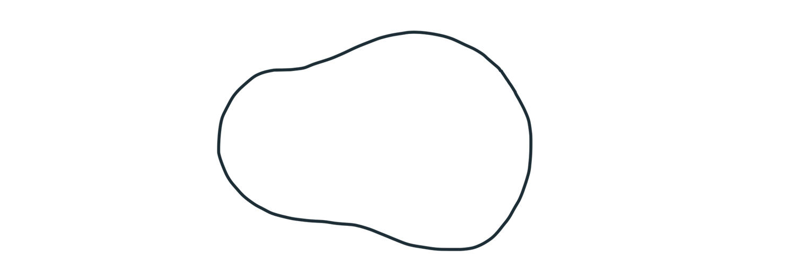
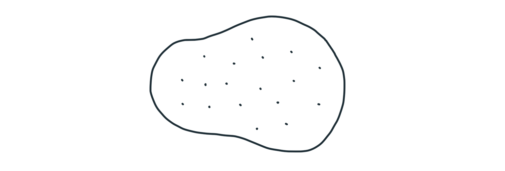
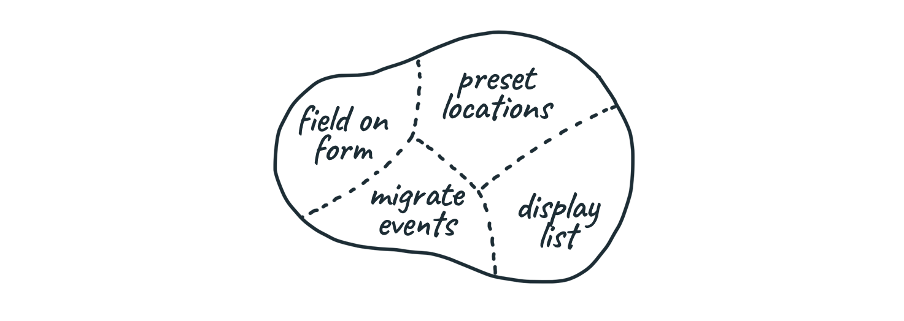
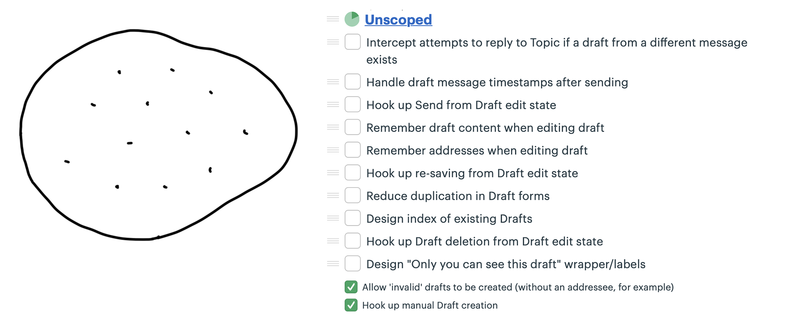
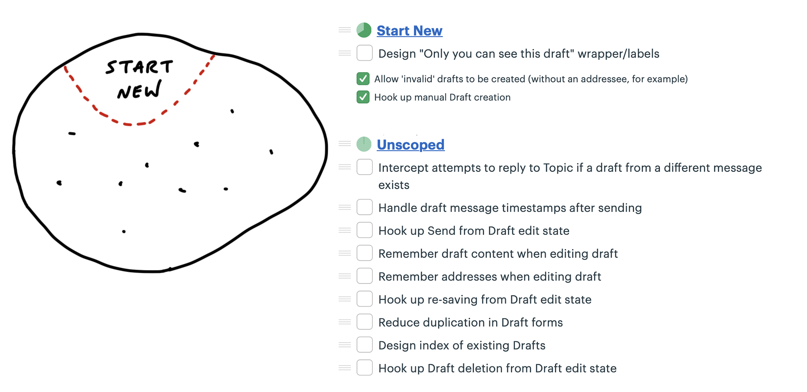
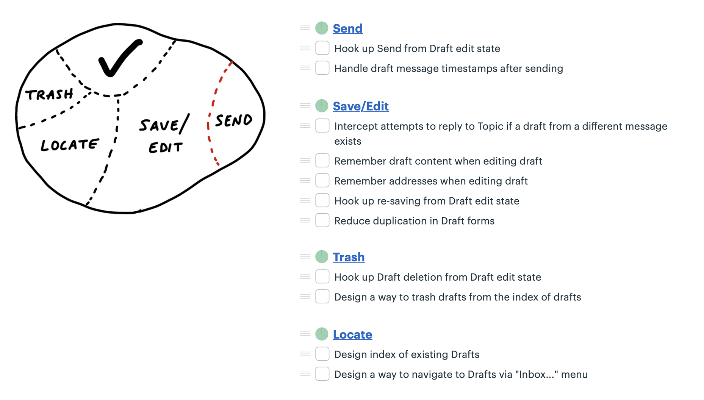
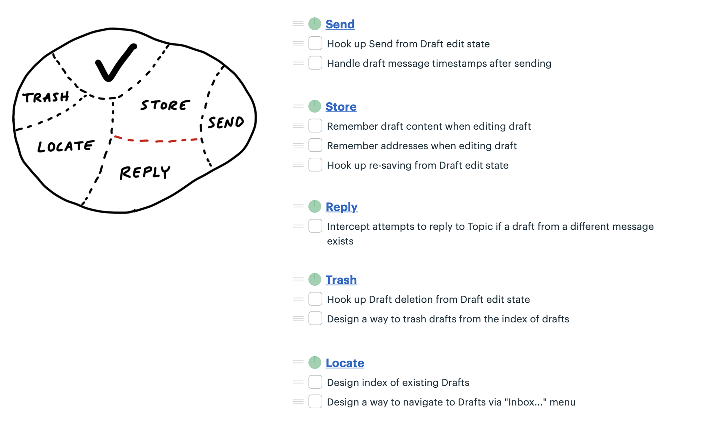
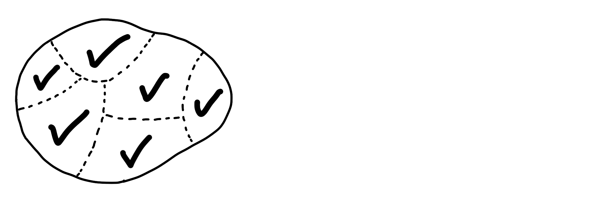
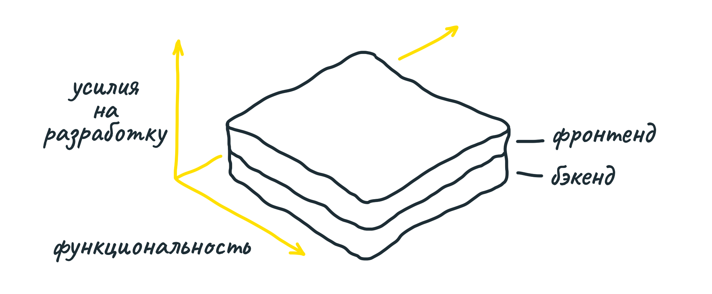
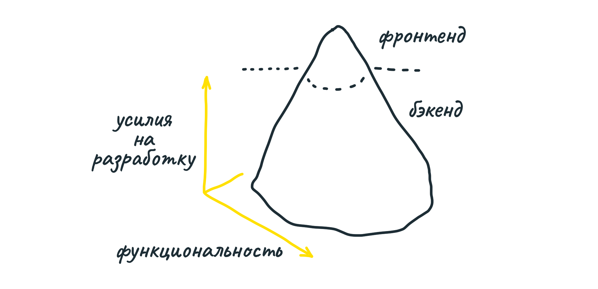

##  Карта проекта

В прошлой главе мы начали работу, выделив один осмысленный кусок и проработав его до полной готовности. Этот приём — часть более общей техники организации работы над проектом.

### Организуйте работу исходя из структуры проекта, а не ролей

Часто задачи группируют по исполнителям или ролям. Например, ведут список задач для дизайнеров и для разработчиков. Это приводит к проблеме, которую мы затронули ранее — люди завершают задачи, но задачи не складываются в единое решение.

Представьте, что вы организуете благотворительный вечер. Вы можете создать отдельный список дел для каждого из трёх волонтёров, но тогда вы не сможете быстро увидеть общую картину и понять, как движется проект в целом — что готово, а что нет. 

Вместо этого вы группируете дела в соответствии с тем, из каких частей состоит проект. Тогда ими можно управлять независимо. Например, вы создаёте списки дел для питания, освещения и звука, подготовки сцены, и так далее. Тогда, взглянув на эти списки, вы быстро поймёте, какие части готовы, а какие нет.

В разработке программных продуктов структура часто неизвестна заранее. Мы создаём вещи, которых раньше не делали. Каждый проект — неизведанная территория, которую нужно обойти, чтобы нарисовать карту. Только начав работу, мы понимаем, что с чем связано, что можно делать независимо.

В прошлой главе мы отметили, как куски проекта включают себя интегрированные слои (обычно фронт-енд и бэк-енд). Только полностью закончив один кусок, мы переходим к следующему. Это намного лучше, чем работать над разными кусками и надеяться, что к концу цикла всё волшебным образом соединится в работающую систему.

Давайте называть такой кусок проекта «участком», по аналогии с участком земли. Мы берём целый участок проекта и нарезаем его на отдельные участки, которые могут быть реализованы независимо. В этой главе мы рассмотрим, как команда создаёт карту участков и работает с ними один за другим.

### Карта участков

Представьте себе проект с высоты птичьего полёта. Вначале обозначены только границы всего проекта. Они — результат предыдущей работы менеджера по формированию проекта. Внутри этого участка нет никаких задач или разделителей.

Начав работу, команда обнаруживает и создаёт задачи. Вполне естественно начинать с задач, они конкретны и неделимы. Пока ещё рано их группировать. В этот момент наша карта — это границы участка проекта, внутри которого там и сям натыканы задачи.

Но это ещё не конец. С высоты не видна общая картина, задача — слишком мелкая деталь на карте.
По мере работы (но не сразу!) команда понимает, как разные задачи связаны друг с другом. Начинает вырисовываться структура проекта, задачи можно сгруппировать, обозначив границы отдельных участков.

Участки обозначают осмысленные куски проекта, над которыми можно работать независимо. Важно, что они небольшие — несколько дней работы. Намного меньше, чем целый проект.

Карта — это визуальный образ. На практике мы определяем участки при помощи отдельных списков задач. Каждый участок — это название списка. Внутри списка — задачи этого участка.

Участки — это не просто куски проекта. Их названия становятся терминами, при помощи которых команда общается. Например, «когда _Частичный доступ_ будет готов, можно заняться _Приглашением Наблюдателей_. А обновим _Сохранение видимости_ после того, как подключат _Переключатель доступа_».

Отчитываясь о результатах, команда использует эти термины, чтобы рассказать, что в каком статусе. Оперировать подобными названиями участков на обсуждении верхнего уровня намного удобнее, чем опускаться на уровень отдельных задач. (Подробнее об отчётах — в главе, посвящённой графикам-холмам).

### Пример проекта: черновики сообщений

Команде выдали проект создания и сохранения черновиков сообщений. После презентации дизайнер и разработчик встретились и записали задачи, которые сразу пришли им в голову. Список задач назвали «Unscoped» — участков ещё нет.

К концу первой недели работы они завершили некоторые задачи, но показывать было нечего. Следуя правилу «заверши один кусок», они обозначили один участок — «Cоздание черновика» (Start new) — и сфокусировались на нём.

Некоторые задач из «Unscoped» переместились в список «Cоздание черновика». Оказалось, что для завершения этого участка осталось закончить только одну дизайн-задачу. После этого участок был готов.

Глядя на оставшиеся в списке задачи, команда решила выделить ещё несколько участков — задачи, посвящённые поиску, ушли в участок «Поиск» (Locate), задачи про удаление — в участок «Удаление» (Trash). Всё, что осталось, пока что примерно назвали «Сохранить или редактировать» (Save/Edit).

Обратите внимание на участок «Поиск» (Locate). Сейчас там только одна задача (список черновиков). Но когда дойдёт до дела, там точно появятся новые задачи.

По мере работы над «Сохранить или редактировать» разработчик обнаружила, что можно поделить участок на два, разных по смыслу, чтобы быстрее достигнуть видимого результата по каждому из них. Задачи, относящиеся к отправке, она перенесла в новый участок — «Отправка» (Send).

Наконец, пара оставшихся задач в «Сохранить или редактировать» была на самом деле про хранение информации, и ещё одна задача была про обработку особой ситуации при ответе на другое сообщение. Разработчик переделала участки таким образом:

И в этот момент у команды возникло понимание — что именно представляет из себя проект на верхнем уровне. Все части по отдельности имели смысл и были логично связаны друг с другом. Ни одна часть не была слишком большой, чтобы потерять прогресс или не заметить что-то важное.

Тем временем дизайнер работал над участком «Поиск». После небольшой интеграции, этот участок отметили как готовый. Задачи завершались также в участках «Отправки» и «Хранения».

Когда и эти участки были завершены, осталась лишь пара задачи в участках «Корзина» и «Ответ».

И вот, весь проект был завершён.

### Обозначение участков

Обозначение участков — не «планирование проекта». Надо пройти по территории, прежде чем рисовать её карту. Должным образом обозначенные участки — не просто группы задач или категории, призванные разбить слишком длинный список. Они отражают смысл частей, над которыми можно работать независимо, и связей между этими частями.

Выделив связанные задачи в участок, можно сказать, когда весь участок «готов». Но эти связи часто не видны заранее. Помните про разницу придуманных и обнаруженных задач? Тот же принцип применим и к участкам. Границы участков вырисовываются в процессе работы и наблюдения за тем, как связаны части проекта.

Вот почему в начале проекта никто не ожидает чётко распланированных участков. Чаще всего они готовы к концу первой или началу второй недели, после того как команда немного поработала и прошла по территории.

Также нормально переделывать участки в процессе. Их размер и названия меняются по мере того, как команда всё лучше понимает проект.

### Как понять, верно ли размечены участки

Хорошо размеченные участки соответствуют анатомии проекта. Вы легко можете объяснить другому человеку, где у вас болит, поскольку у частей тела есть общепринятые названия (руки, ноги, голова), которые соответствуют анатомии. У каждого проекта есть подобная анатомия, продиктованная его архитектурой, окружением и взаимосвязями.

Есть три признака того, что участки размечены хорошо:

1. Вы чувствуете, что видите состояние проекта целиком, и ничто важное не скрыто на уровне отдельных задач;
2. Названия участков помогают в обсуждении проекта, делают их легче и понятнее, а не наоборот;
3. Вы сразу понимаете, в какой участок добавить каждую новую задачу. 

И наоборот, вот три признака того, что участки стоит переразметить:

1. Трудно понять, насколько готов участок. Это часто происходит, когда задачи внутри участка не взаимосвязаны. Тогда завершение одной задачи никак не влияет на готовность других. В этом случае стоит выделить некоторые задачи в отдельные участки.

2. Название участка слишком общее, например «фронт-енд» или «баги». Это знак того, что участок недостаточно независим или не отражает какую-то смысловую часть проекта. Например, вместо участка «Баги» мы распределяем их по участкам исходя из содержания — этот баг Отправки, этот Хранения, и так далее.

3. Участок слишком велик — он становится похож на целый проект с длиннющим списком задач. Лучше разбить такой участок на несколько, каждый из которых можно быстро довести до готовности. 

Напоследок — пара советов о разных видах участков.

### Торты

Чаще всего проекты требуют два «слоя» работы — дизайн (фронт-енд) и серверный код (бэк-енд). Допустим, часть приложения принимает данные от пользователя, сохраняет их в базе и отображает в каком-то виде. Работа над такими приложениями выглядит как торт из двух примерно одинаковых слоёв — объём работы над бэк-ендом можно оценить, глядя на дизайн. Поэтому можно смело интегрировать задачи обоих слоёв в один участок.

### Айсберги

Но иногда ресурсы а бэк-енда требуется намного больше фронт-енда (или наоборот). Например, дизайн состоит только из одной небольшой формы, но обработка этой формы требует сложной бизнес-логики. Такая работа скорее напоминает айсберг.

В таких случаях мы выделяем фронт-енд в отдельный независимый участок (при условии, что интерфейсные решения не зависят от серверных). А если бэк-енд слишком сложен для одного участка, стоит разбить на части и его. Основная цель этих упражнений — выделить вещи, которые можно быстро довести до готовности, и не доводить проект до ситуации, когда работа по многим участкам должна завершиться в последний момент.

Изредка бывает айсберг «наоборот» — сложный фронт-енд и простой бэк-енд. Например, в модели данных календаря нет ничего особого, но зато есть куча фронт-енда, например, обработка событий длиной в несколько дней, привязка к сетке, и так далее.

Натыкаясь на любые айсберги, мы подвергаем их сомнению, прежде чем начать работу. А точно нужна такая сложность? Точно не осталось способов её уменьшить? Насколько необходим такой богатый интерфейс? Можно ли выстроить серверные процессы с меньшим количеством зависимостей?

### Винегрет

Почти всегда находится пара задач, которую не засунешь ни в один участок. Мы позволяем себе добавить участок под названием «Винегрет» для таких задач. Но мы пристально следим на его содержанием — если в нём больше 3-5 задач, мы что-то сделали не так и какой-то участок ждёт, пока его заметят.

### Отмечайте необязательные задачи

По мере изучения проблемы вы всё время будете создавать новые задачи. Какой-то код лучше бы почистить, какой-то нестандартный случай — обработать. Мы отмечаем задачи, которые «лучше бы» сделать, префиксом «~». Так команда сразу видит, какие задачи обязательны, а какие нет.

В мире с бесконечным бюджетом и сроками, можно улучшать всё без перерыва. Но в реальности, нам нужно постоянно обрубать щупальца растущего объёма работ. Знак «~» в начале названия задачи или целого участка — наш способ сделать это. (Подробнее в главе 14).