## Демонстрируйте прогресс

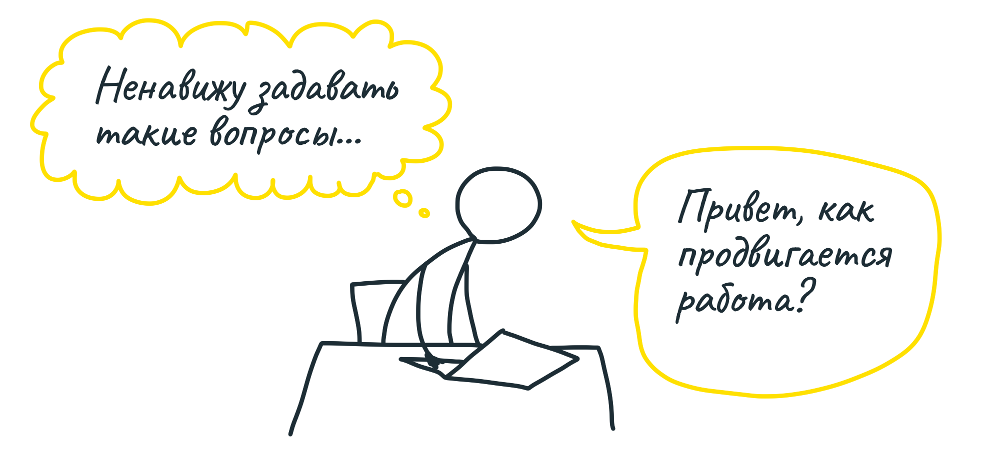

Хороший менеджер не любит спрашивать, как продвигается работа. Неловко отвлекать тех, кто занят работой, и особенно неприятно, когда полученный ответ требует дополнительных вопросов.

Удобнее, когда есть место, которое в любой момент показывает актуальный статус. В прошлой главе мы узнали, как группировка задач в «участки» помогает команде понимать, что они делают. Но менеджеру эта информация не так полезна. Есть причины, по которым использовать списки задач для понимания статуса неэффективно.

### Задачи ещё не сформулированы

Допустим, менеджер видит список, в котором несколько завершённых задач и ни одной незавершённой. Как будто вся работа сделана. Однако может быть, команда знает, что ещё нужно сделать, просто пока не сформулировала задачи.

Иногда команда обозначает участок раньше, чем заполняет его задачами. Так она формулирует, «что» нужно сделать, пока не углубляясь в то, «как».

Ещё пример — тестирование в конце цикла разработки. Тестировщики добавляют задачи в участки, которые до этого были полностью «готовы».

Вспомните о разнице «придуманных» и «обнаруженных» задач. Наивно полагать, что можно заранее составить список дел, делать их и ставить галочки — одну за другой. В реальности, списки задач растут по мере работы над проектом.

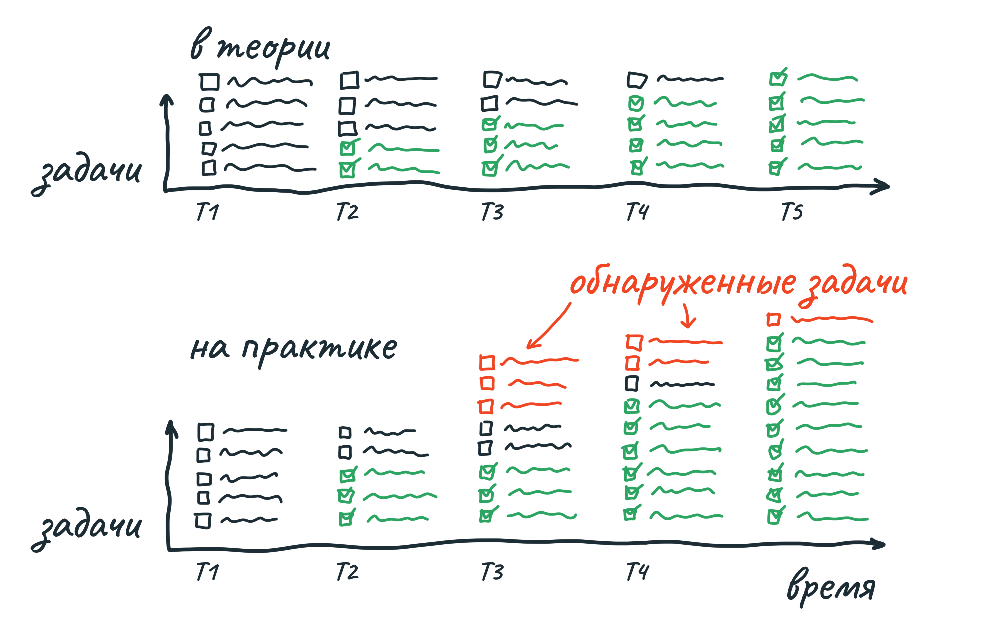

В примере выше, если бы менеджер хотел узнать, как идут дела, в момент T2, список задач ввёл бы его в заблуждение. Сторонний наблюдатель ничего не знает о том, больше или меньше станет невыполненных задач. Чтобы предсказать это, нужно быть в контексте — понимать, что конкретно готово и какие новые задачи могут возникнуть.

### Оценки не учитывают неопределённость

Некоторые команды добавляют числовую оценку к каждой задаче или участку. Проблема с оценкой — в том, что у разной по сути работы оценка будет означать совершенно разные вещи.

Допустим, есть 2 задачи, каждую из которых оценили в 4 часа. При этом первая задача похожа на то, что команда уже делала много раз, значит, оценке можно доверять. А вторая задача — совершенно новая. Если всё пойдёт по плану, действительно заняло бы 4 часа, но на практике вышло 3 дня. А оценка «от 4 часов до 3 дней» не имеет смысла.

Мы придумали свой способ показывать статус работы, без статистики задач и без числовых оценок. Вместо разделения «не сделано / сделано» мы обращаем внимание на «неясно / ясно». Для работы с этой метрикой мы используем метафору холма.

### Работу сделать — холм преодолеть

У каждой работы есть две фазы. Первая — движение вверх по холму, выяснение, что именно нужно сделать, и как конкретно это сделать. На вершине холма — полное понимание предстоящих действий. И вторая фаза — движение вниз по холму, выполнение действий. 

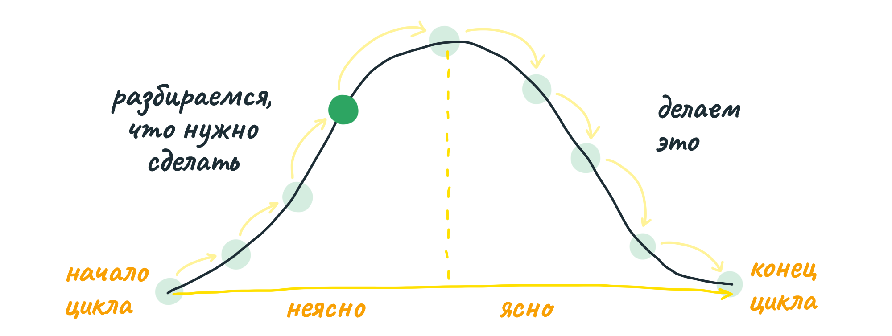

Вот пример. Вы планируете организовать вечеринку. Вы уже знаете дату, до неё ещё пара недель и вы не начали продумывать, что будете готовить. Вы — в начале пути.

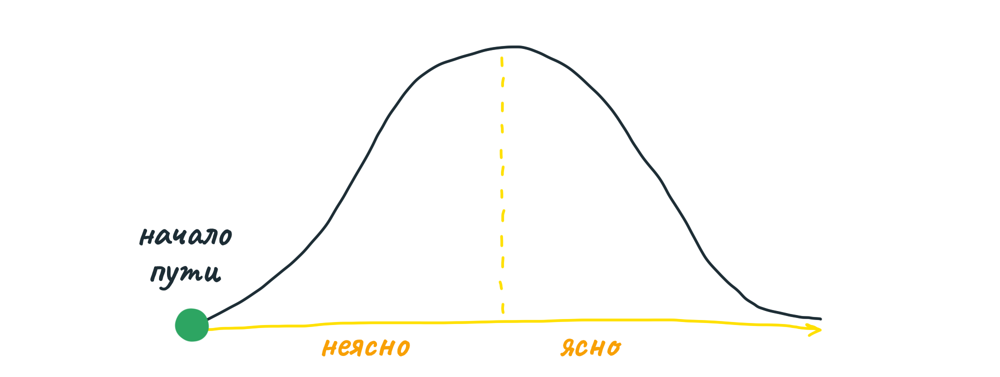

Вы составляете список гостей, и обращаете внимание, что пара из них — вегетарианцы. Гриль придётся вычеркнуть, но есть много других вариантов. Вы размышляете про итальянскую или индийскую кухню, и склоняетесь к индийской, она вам интереснее. 

В этот момент вопрос «на сколько процентов завершён проект?» не имеет смысла. Если кто-то попросит вас оценить время на шопинг и другую подготовку, вы не сможете — вы ещё не выбрали, что именно будете готовить. Правильный ответ такой — «я провёл работу по выбору типа кухни, но ещё не определился с точным набором блюд». 
На нашем графике этому состоянию соответствует середина пути вверх по холму.

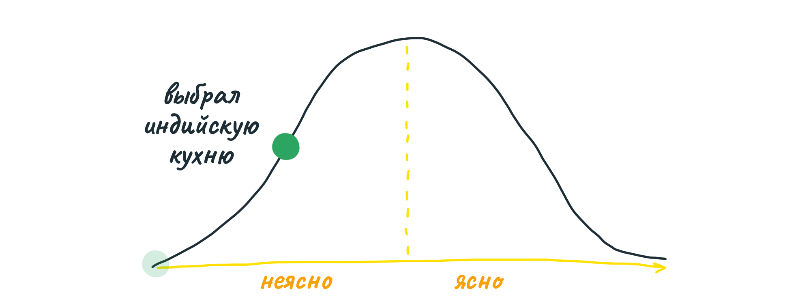

Вы изучаете рецепты и выбираете блюда, которые вам интересно приготовить, но чтобы не было слишком экзотических ингредиентов. В процессе поиска вы составляете список продуктов, которые нужно купить. 

Это совсем другая ситуация. От «я ещё не знаю, что делаю» вы пришли к «теперь всё ясно, осталось пойти и сделать». Вы — на вершине холма.

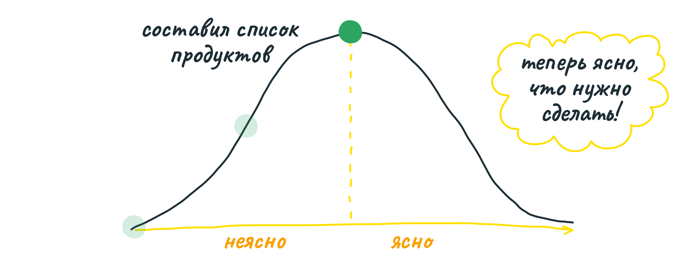

С этой точки вам видны все действия, которые осталось совершить. Теперь можно оценить время — пару часов на магазин, полчаса на разгрузку, час на готовку, и так далее.

Накануне вечеринки вы едете в магазин и покупаете продукты. Вы — на пути вниз по холму.

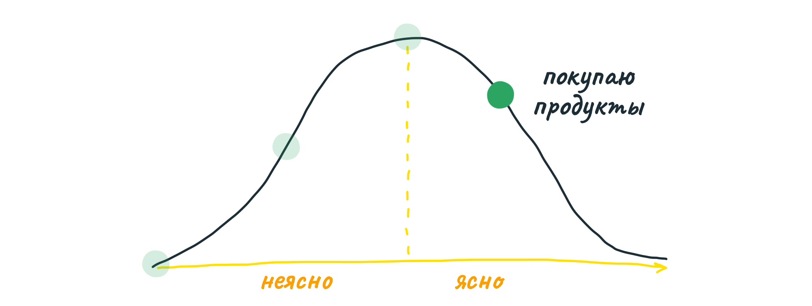

Дальше, вы готовите еду и встречаете гостей.

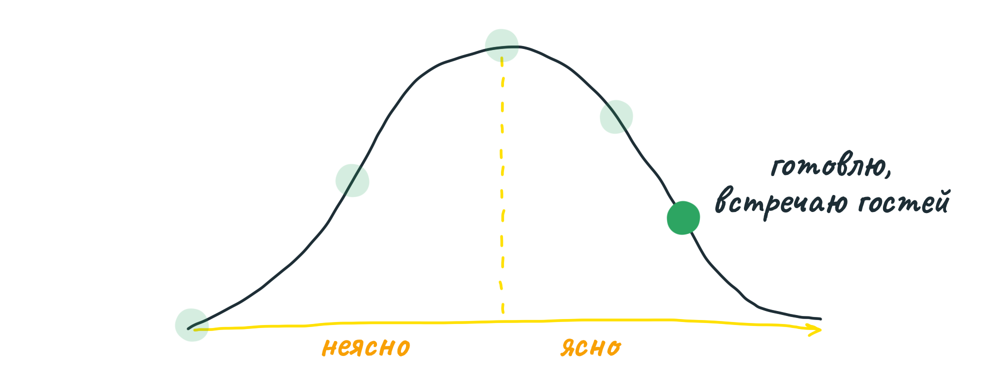

Когда гости ушли, остаётся вымыть посуду.

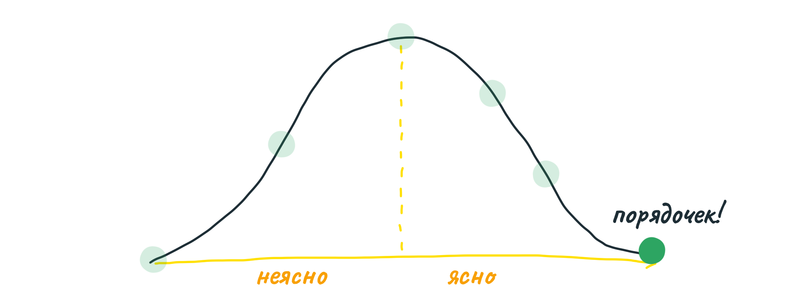

Обратите внимание — график-холм помогает показать разницу в ощущениях на разных стадиях работы. Путь вверх полон неопределённости, поисков ответов, решения проблем. Путь вниз — уверенность, ясность, полный контроль и понимание.

### Участки на холме

Мы можем объединить метафору «холма» с метафорой «участков» из прошлой главы. Разметив участки и дав им названия, мы говорим о частях проекта друг с другом одними и теми же словами. А перемещая участки по холму, мы сообщаем их статус (вверх или вниз).

Например, обозначим участки точками разных цветов на графике-холме:

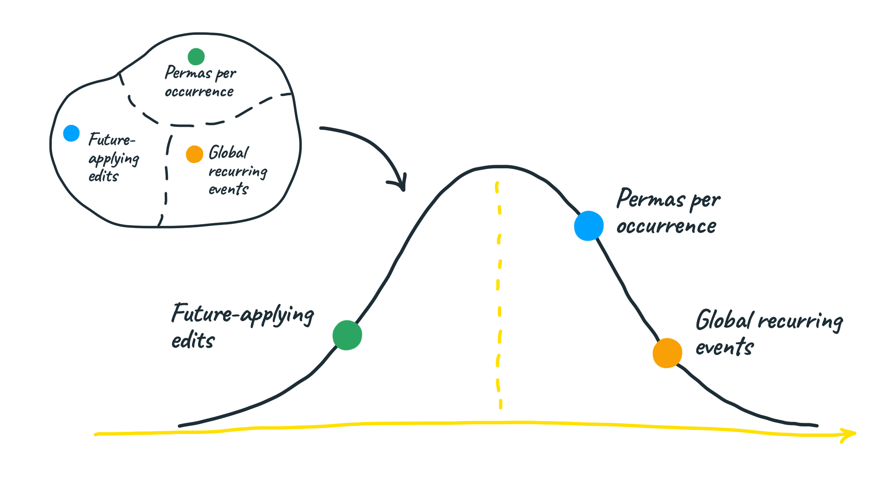

Это — скриншот реального проекта по поддержке повторяющихся событий в Basecamp. Участок «Future-applying edits» всё ещё «карабкается наверх», там много неясного. С остальными двумя всё ясно, а «Global recurring events» уже близок к готовности.

### Отчёт о статусе без вопросов и ответов

Мы в Basecamp отслеживаем статус всех работ при помощи графиков-холмов. Участники команд, у которых есть полная информация по состоянию проекта, просто перетаскивают участки на подходящее место на холме. 

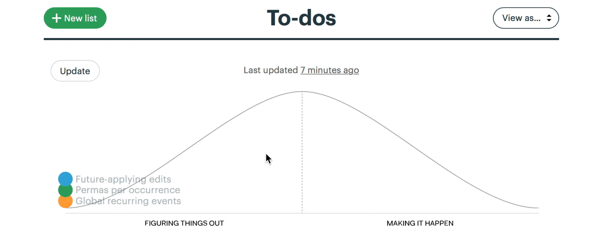

У менеджеров появляется ценная возможность — видеть работу в динамике, не только где на холме работа прямо сейчас, но и как она движется во времени.

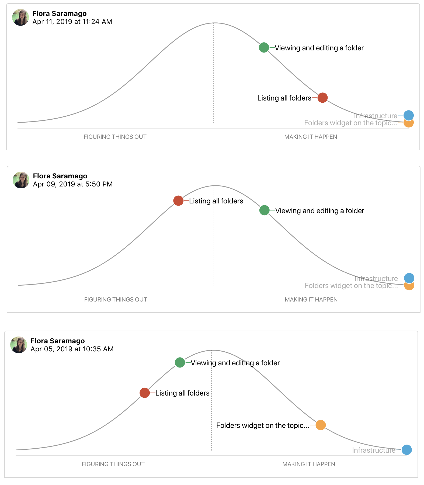

Сразу видно, есть ли где-то затык. Можно понять, над чем команда работает сейчас и сколько времени у них уходит на какую часть работы.

Этот график — основной источник информации по состоянию проекта для менеджера. График не требует от менеджера отвлекать команду вопросами. А если на графике видна проблема — менеджер может сразу начать предметный разговор. «Похоже, что Autosave застряло на пути к вершине холма. В чём там неясность?».

### Не приходится говорить «Не знаю»

Никто не любит говорить «Я не знаю, как это сделать» (пусть даже пока). Упустить момент, когда работа встала или команда ходит кругами — самый большой риск. Этот момент важно поймать как можно раньше, тогда можно привлечь помощь или переосмыслить проблему. Иначе одна задача может поставить под угрозу весь проект.

График-холм деликатно показывает возможный затык, без необходимости исполнителю формулировать его. Ищите на графике точку, которая стоит на месте на пути вверх:

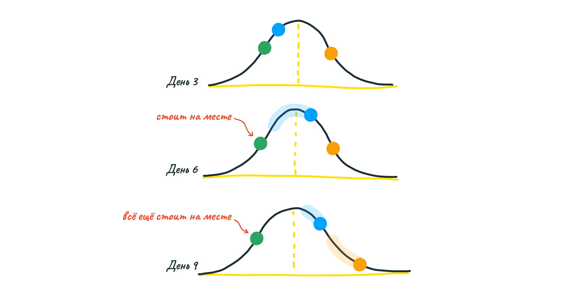

Терминология холма также помогает построить разговор более конструктивно — обсуждение строится вокруг задачи («как нам перевалить эту задачу через вершину?»), а не человека («похоже, ты застрял»).

### Слишком большие участки

Иногда участок, застрявший по пути на вершину, просто слишком большой, и работа по нему идёт нормально, но не отражается в графике.

Однажды участок под названием «Notify» застрял на пути к вершине холма:

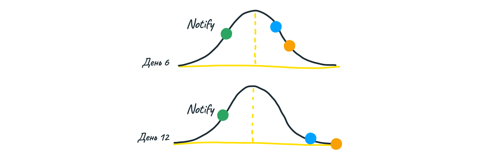

Пообщавшись с командой, менеджер узнал, что работа идёт хорошо, но фактически внутри участка спрятались три независимых куска — дизайн письма, отправка письма на бэк-енд и показ уведомления. Первые два куска были готовы, а работа над уведомлением ещё не началась, поэтому участок целиком не менял статус. 

Проблема решилась простым разделением одного участка на три.

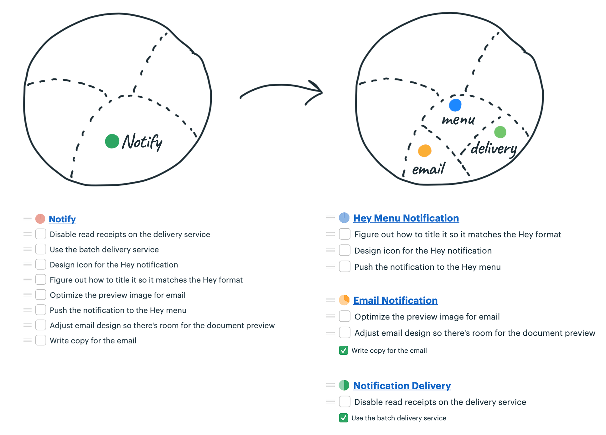

Теперь каждый участок можно поместить на подходящее место на холме.

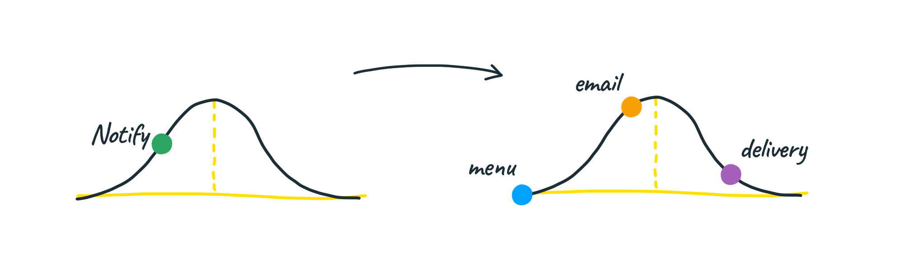

Теперь эти участки движутся по холму независимо, и менеджер может следить за изменением их состояния во времени. Профит!

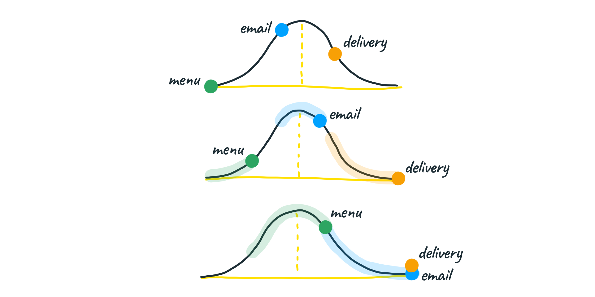

### Проложите дорогу наверх

Когда люди начинают применять на практике графики-холмы, иногда им приходится возвращать точки на графике обратно, к началу или в левую половину. Это происходит, когда команда решает, что с работой всё ясно, а потом обнаруживает неразрешённый вопрос. 

Частая причина этого — кто-то проделал подготовительную работу в голове, но не на практике. У нас часто есть иллюзия понимания («я просто использую вот это API»), но реальность оказывается более сложной. 

Нам помогают вот такие подсказки — первая треть пути наверх означает «у меня есть мысли по этому поводу», вторая треть — «я проверил свои предположения», и последняя — «я сделал достаточно много, чтобы быть уверенным, что сюрпризов не будет».

### Задачи в правильном порядке

Кроме понимания состояния проекта, мы используем графики-холмы для того, чтобы брать «участки» в работу в правильном порядке.

Дело в том, что некоторые участки скрывают в себе больше риска, чем остальные. Представьте себе два участка: геокодирование данных и рассылка уведомлений по почте. Оба участка содержат неопределённости, и оба участка сейчас находятся в начале пути по холму (работа не начата). Однако у команды совсем нет опыта в геокодировании. Спросите себя — если нам будет не хватать времени, какой участок безопаснее затащить на вершину первым? 

Очевидно, первый, в котором больше риска. Команда в первую очередь передвигает первый участок наверх (разбирается с геокодированием, находит все решения), затем берётся за другие важные задачи, зная, что риск на участке Геокодирования минимизирован.

Любая работа стремится занять отпущенный ей объем времени. Если бы команда начала с уведомлений, можно было бы незаметно потратить недели, вычищая тексты и внося правки в дизайн. Можно, но не нужно. В последнюю неделю цикла вполне можно потратить день и сделать _достаточно_ хороший шаблон письма. С другой стороны, если оставить на последний момент геокодирование, велик шанс, что в процессе работы возникнут проблемы, которые займут недели. 

В журналистике есть термин «перевёрнутая пирамида». Смысл в том, что статья начинается с самой ценной информации в кратком виде, и уже потом идут подробности, раскрывающие тему. Это позволяет сверстать газетный разворот так, что самое важное можно прочитать сразу, не разворачивая газету. 

Разработчики используют подобный способ — «прогрессивный JPEG» — решая, в каком порядке брать задачи в работу. Сначала — дотащить самые важные задачи, с наибольшей неопределённостью, до вершины холма. Спустить их с холма, проработав все детали, можно позже.

Приближается конец цикла, все важные задачи завершены, здесь и там остались кучки незавершённых задач с пометкой «~» (необязательно). В следующей главе мы обсудим, в какой момент стоит остановиться.
