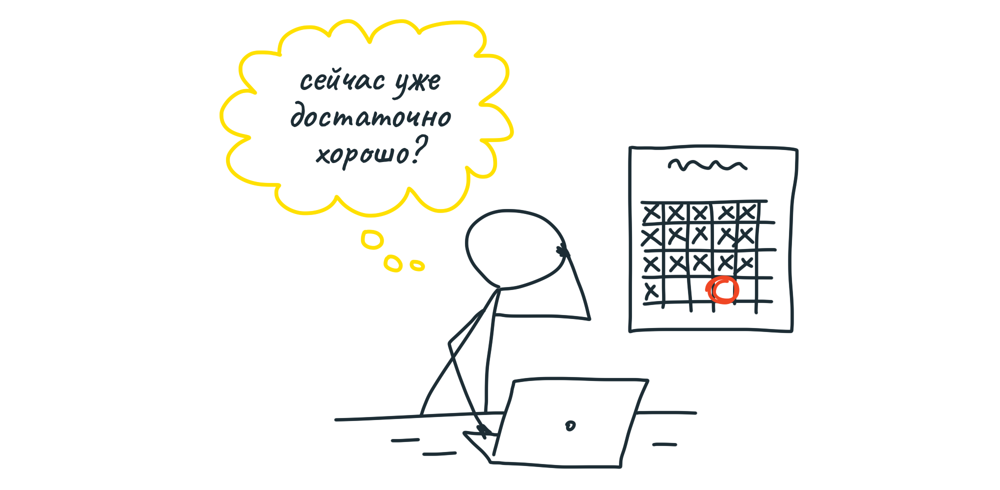
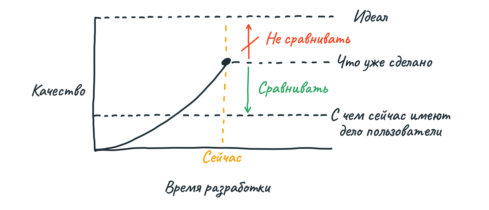

## Решите, когда остановиться

Следуя описанным выше приёмам, команда подходит к концу цикла в хорошей форме. Сформированный проект дал разработчикам чёткое направление, адекватно размеченные участки позволили разбить проект на удобные куски и довести их до готовности. Все важные задачи 
с наибольшей неопределённостью завершены, поскольку их взяли в работу в первую очередь.

Однако задач всегда больше, чем времени на них. Завершить проект всегда означает оставить что-то за бортом. Приходит время задать себе неприятный вопрос — может быть, сейчас уже достаточно хорошо? И то, что я сделал, готово к выходу в свет?

### Сравнивайте с текущей реальностью, не с идеалом

Дизайнеры и разработчики хотят сделать всё наилучшим образом. Неважно, находится ли кнопка в самом центре лендинга или в конце длинной страницы настроек — дизайнер отнесётся к ней со всей тщательностью. Разработчики также стремятся к тому, чтобы код был максимально читаем, логичен и обрабатывал все возможные сценарии. 

Подобная гордость важна для морального духа, но нужно направить её в верное русло. Стремясь к идеалу, мы не достигнем ничего. С другой стороны, не хочется понижать планку качества. Где та золотая середина, где можно уверенно сказать «теперь достаточно хорошо»?

Решение простое. Вместо абстрактного идеала сравнивайте результат своей работы с тем, как сейчас решают данную проблему пользователи, с их текущей реальностью. Какой костыль они сейчас используют? Насколько ваша работа улучшит их жизнь? Сколько им придётся терпеть, пока вы вычищаете все детали или сравниваете разные варианты дизайна?

Сравнение того, что мы успели сделать, с тем, как сейчас решают проблему пользователи, а не с идеалом, даёт нам настоящее ощущение прогресса. Становится легче отменять задачи, замедляющие проект. Меньше думаешь о себе, больше — о пользователе. Можно сказать себе: «Возможно, это не идеально, но точно работает как надо и для пользователей будет заметное улучшение».

### Ограничения диктуют компромиссы

Вспомним правило предохранителя — если проект не завершён за 6 недель, он отменяется.

Это ограничение заставляет команду идти на компромиссы. Каждый раз, задав вопрос «А не лучше ли...», мы сразу добавляем — а есть ли на это время? Жёсткий дедлайн не даёт пойти в работу задачам, которые не стоят затраченного времени.

Мы ожидаем, что команды будут активно срезать углы и подвергать все новые задачи сомнению, вместо того, чтобы работать по ночам в конце цикла. 

### Списки дел растут сами по себе

Как сорняки. И это не вина заказчиков, менеджеров или разработчиков. Детали не видны заранее. Только начав работу, а иногда сделав заметную её часть, ты понимаешь, что ещё надо сделать.

Ещё, каждый проект полон надежд, которые не стоит воплощать. Каждой фиче необязательно быть самой эффективной, самой продуманной, самой проработанной. Не каждый сценарий использования одинаково важен для того рынка, которому вы надеетесь продать результат работы.

Такова жизнь. Не пытайтесь вручную остановить рост объёма работ. Вместо этого дайте командам инструменты и полномочия, чтобы они сами регулярно пропалывали сорняки. 

### Отменить задачу не значит ухудшить качество

Решение не делать что-то, или делать частично, совсем не означает оставить дырку в продукте. Взвешенный выбор делает продукт лучше в целом, потому что он становится лучше _в чём-то_ вместо чего-то другого. Набор принятых вами решений _отличает_ продукт от конкурентов, создатели которых принимали другие решения.

Уменьшить объём работы не значит пожертвовать качеством. Мы чрезвычайно требовательны к качеству кода, дизайна, текста и производительности. Секрет в том, чтобы постоянно спрашивать себя — это точно имеет значение, точно ценно для пользователей?

### Вколачивание объёма

Часто говорят «урезать» объём работ. Мы используем более жёсткое слово — «вколотить» объём в сроки (scope hammering) — для обозначения силы, которую надо применить к объёму работы, чтобы уместить его во временные рамки.

Вот вопросы, которые мы себе задаём:

* эта задача точно обязательна для результата?
* а без неё можно завершить проект?
* что будет, если задачу отменить?
* это что-то новое, или уже привычное для пользователей?
* как часто возникает этот сценарий или условие?
* это массовый сценарий, или нестандартный?
* если описанный случай возникает, каковы его реальные последствия?
* если что-то не так в описанном сценарии, насколько он вообще подходит для нашей аудитории?

Жёсткий дедлайн мотивирует нас задавать вопросы, а возможность менять объём работы — искать ответы и действовать. Вколачивая объём работы во временные рамки, ищем то, что действительно важно, и фокусируемся только на этом.

Для каждой новой задачи, команда решает, обязательная она или нет. Проект не завершён, пока не завершены все обязательные задачи. И наоборот, в завершённом проекте могут оставаться незавершённые необязательные задачи. Мы обозначаем их знаком «~» в начале названия. Если будет время — их возьмут в работу, если нет — их отменят. Обычно отменяют. Отметка «~» и есть вколачивание.

### Тестирование — только для нестандартных сценариев

В Basecamp сейчас работает один тестировщик (на дюжину человек в продуктовых командах и около миллиона пользователей). Он включается в работу ближе к концу каждого цикла и проверяет нестандартные сценарии, выходящие за рамки основного поведения.

Это возможно, поскольку дизайнеры и разработчики несут личную ответственность за качество своей работы. Разработчики сами пишут тесты, и вся команда проекта участвует в проверке результата. Это — следствие того, что команда получила неограниченные полномочия и полную ответственность в момент передачи проекта (см. главу 9).

Много лет у нас вообще не было тестировщика. В какой-то момент количество пользователей выросло настолько, что некоторые сценарии, которые мы считали нестандартными, стали затрагивать сотни или тысячи пользователей. Добавление процесса тестирования позволило улучшить обработку таких сценариев и снизить нагрузку на поддержку.

Поэтому мы считаем тестирование «переходом на новый уровень», а не этапом, который обязательно должен пройти каждый. Наличие тестировщика сильно нам помогает, но не является обязательным условием для создания качественного продукта.

По умолчанию тестировщик создаёт необязательные задачи (со знаком «~»). Команда отсматривает их и переводит в обязательные в зависимости от критичности и времени. Обычно тестировщик ведёт свой список (участок), а команда переносит взятые в работу задачи в участок, подходящий по смыслу. Так видно, какие участки снова требуют завершения.

Аналогично мы относимся и к проверке кода (code review). Команда имеет полномочия опубликовать код без ревью. Однако ревью делает код лучше, поэтому если есть время, один из руководителей может сделать ревью и дать обратную связь. Это скорее возможность обучения и прокачивания навыков, чем обязательный этап процесса.

### А не продлить ли нам дедлайн

Очень-очень редко мы позволяем проекту продлить срок сдачи на пару недель. В каких случаях?

Во-первых, незавершённые задачи должны реально быть «обязательными» и пережить все попытки вколачивания объёма в сроки.

Во-вторых, вся оставшаяся работа должна находиться на правой половине графика-холма. Никаких неясных зависимостей, никаких открытых вопросов. Любая задача по пути к вершине холма в конце цикла — это следствие ошибки во время формирования проекта. В следующем цикле лучше поставить реализацию на паузу и вернуть проект автору на формирование.

Даже если оба эти условия выполнены, мы предпочитаем соблюдать дисциплину и не продлевать проекты. У команды есть возможность доделать все задачи во время двухнедельного перерыва между циклами — но это не должно становиться привычкой. Работа над задачами во время перерыва — симптом проблемы либо с проектом, либо с эффективностью команды.