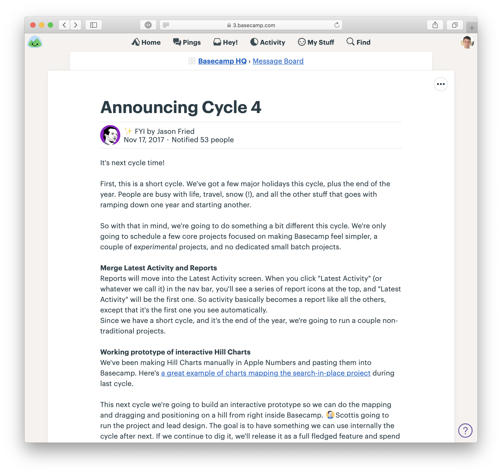
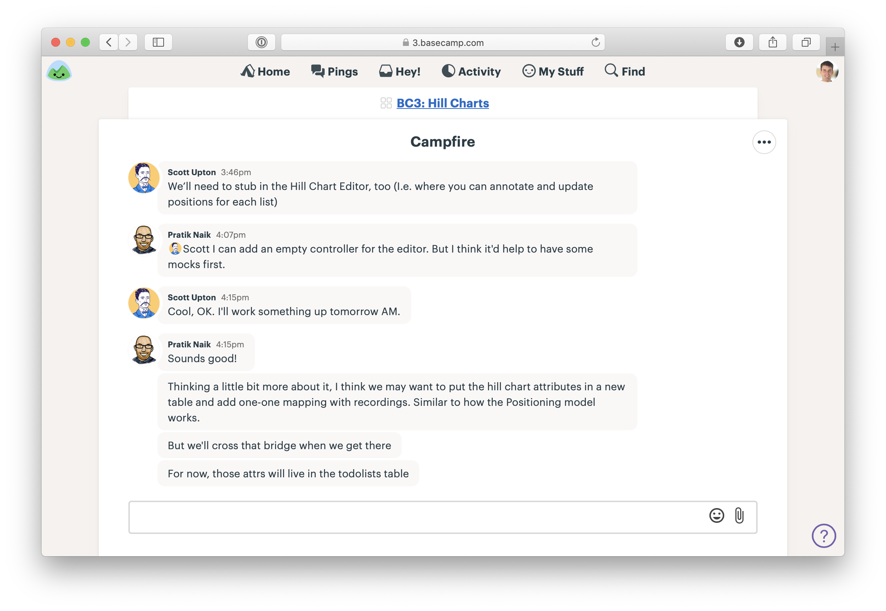
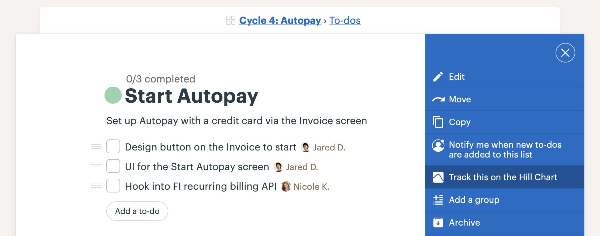
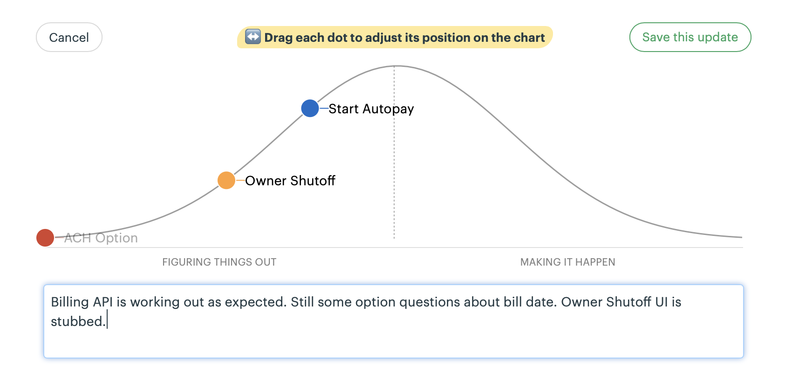

##  Как работать в Basecamp по методу Shape Up

Мы создали Basecamp, чтобы работать в нём по методу Shape Up. Basecamp позволяет нам вести общение, управление задачами и документацию в одном месте. Вот как мы это делаем.

### Команда для формирования проектов

1. Создайте команду, которая будет формировать проекты. У нас она называется «Продуктовая стратегия».

2. Добавьте в команду людей, которые доверяют друг другу принципиальные решения — они будут давать отзыв на презентации проектов и отдавать свои голоса на голосованиях. Важно, чтобы команда была небольшой. Результаты работы этой группы публикуйте на всю компанию перед началом цикла.

3. Внутри команды, публикуйте презентации проектов в разделе Сообщений. Мы создали категорию «Презентации» с иконкой-лампочкой.

4. Используйте чат для обмена идеями и координации работы команды. Для самого голосования мы используем видео-звонок.

### Проекты

1. Создайте Проект Basecamp для каждого проекта, над которым будет идти работа в течение цикла. Мы обычно добавляем номер цикла в название, например, «Cycle 4: Autopay.»

2. Добавьте в проект дизайнеров и разработчиков, которые будут над ним работать.

3. Опубликуйте сообщение с презентацией проекта (оригинальной или отредактированной для команды разработки).

### Участки — списки задач

1. По мере погружения в проект, команда создаёт задачи и размечает участки.

2. Внутри проекта, команда создаёт список задач для каждого участка, например, «Start Autopay» или «ACH Option.». Описание списке может содержать подробности, не вошедшие в название.

3. Команда добавляет все свои задачи в список, независимо от типа задачи (фронт-енд, бэк-енд, тестирование, прочее). Например, в примере ниже в списке «Start Autoplay» — две задачи для дизайнера и одна для разработчика. На странице задачи можно обсудить возникающие вопросы.

4. Повторяйте шаги 2 и 3 до готовности.

### Следите за прогрессом с помощью графиков-холмов

1. На странице списка задач нажмите (•••) справа-сверху. Выберите Track this on the Hill Chart. Откроется страница с графиком, на котором появится точка, соответствующая текущему списку задач. 

2. Повторите для каждого списка задач, который нужно отслеживать.

3. Чтобы обновить состояние графика, нажмите Update и перетащите точки. При необходимости добавьте комментарий.

4. Чтобы увидеть историю изменений, нажмите на дату сверху графика.

Basecamp включает в себя чат, сообщения, списки задач и документы — всё в одном интерфейсе, достаточно мощном для специалистов и достаточно простом для любого пользователя. Разработчикам, дизайнерам, тестировщикам и менеджерам одинаково уютно. Попробуйте бесплатно в течение 30 дней — https://basecamp.com/