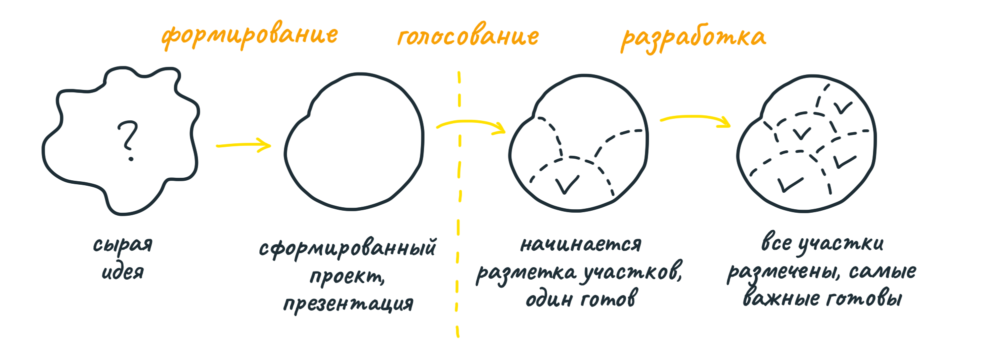
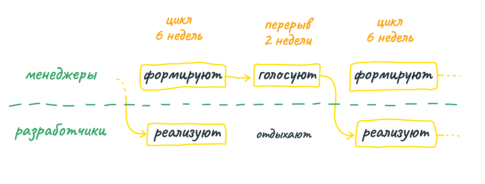

##  Отрегулируйте размер

### Общие правила и конкретные практики

Чтобы внедрение метода прошло быстрее и лучше, отделите общие правила от конкретных практик.

Формировать работу — тоже работа. Формирование устанавливает границы и ожидания для тех, что будет реализовывать задуманное. Если не определить, что конкретно делать, а чего не делать, команде придётся принимать решения в спешке, под давлением сроков и технических ограничений.

То же с длиной цикла. Шесть недель может быть для ваших команд много или мало. Но последствия работы вообще без чётких адекватных сроков одинаковы для всех. Независимо от длины цикла, передача полномочий и правило предохранителя обязательны.

На этапе разработки будут обнаруживаться неопределённости, неважно, отражаете вы их на графике-холме или нет. Обязательно отделить то, что известно от того, что неизвестно, и брать задачи в работу исходя из этого.

Эти общие правила не зависят от размера компании. Однако конкретные практики могут меняться. Рассмотрим два примера — крошечный стартап и большая корпорация.

### Пример 1: крошечный стартап

Когда в компании 2-3 человека, каждый делает всего понемногу. Трудно посвящать длительное время конкретным проектам, ни на что не отвлекаясь. Например, разработчик ещё должен заниматься поддержкой и оборудованием.

В маленькой компании проще общаться и менять направление. Встретились в чате или в коридоре — и вот вся компания в курсе дела.

Поэтому структуру можно выбросить. Вам не нужны циклы, перерывы, формальные презентации и голосование. Вместо команд менеджеров (формирующих проекты) и разработчиков (реализующих проекты) одни люди делают и то, и другое. 

Каждый раз решайте по ситуации, что дальше. Сформируйте проект, оцените аппетит, реализуйте его, беритесь за следующий. Аппетиты могут быть разные — то одна неделя, то три. Вы всё делаете по методу Shape Up, просто более гибко, без жёсткой структуры и этапов.

### Пример 2: большая корпорация

По мере роста компании, гибкость становится недостатком. Спонтанные встречи в чате уже не работают. Координация начинает занимать больше времени, чем сама работа. Кто-нибудь всё время что-нибудь забывает. В этом случае стоит придерживаться строгой структуры, описанной в книге.

Сейчас в Basecamp около 50 людей, из них 12 дизайнеров и разработчиков работают над продуктом, не отвлекаясь на другие задачи. Команда SIP (Security, Infrastructure, and Performance) занимается инфраструктурой. IT-команда отвечает за работоспособность сервисов. Технические специалисты поддержки общаются с пользователями. Всё для того, чтобы команды разработки могли полностью погрузиться в работу над проектами.

Если размер компании позволяет, формировать проекты и реализовывать их можно параллельно. Проект, сформированный и одобренный на текущем цикле, пойдёт в разработку в следующем цикле.

